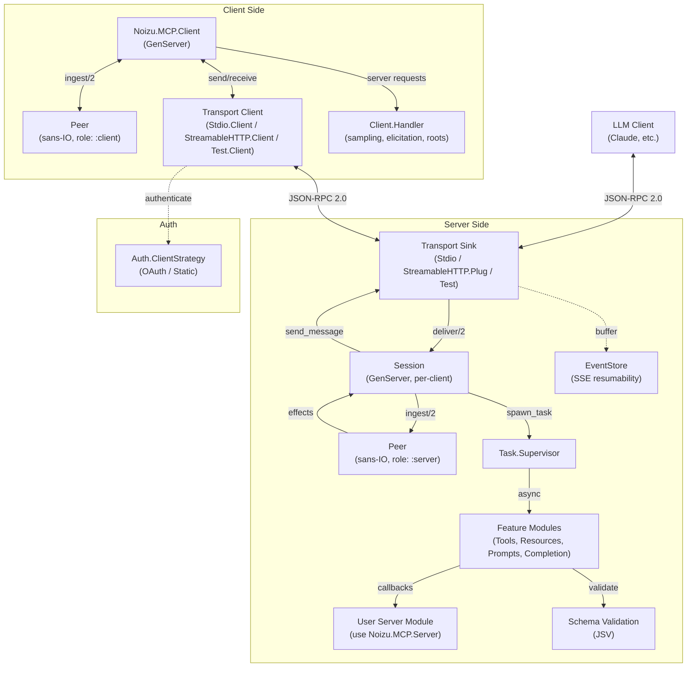

# Project Architecture

## Overview

Noizu MCP is an Elixir library implementing the [Model Context Protocol](https://modelcontextprotocol.io) (MCP) — a JSON-RPC 2.0-based protocol for exposing tools, resources, and prompts to LLM clients like Claude. The library provides both a **server** DSL (`use Noizu.MCP.Server`) and a **client** GenServer (`Noizu.MCP.Client`) sharing a common sans-IO state machine (`Peer`) that separates protocol logic from transport concerns.

## System Diagram

## Core Components

| Component | Module | Purpose |
|-----------|--------|---------|
| Server DSL | `Noizu.MCP.Server` | Behaviour + macros for defining MCP servers |
| Client | `Noizu.MCP.Client` | GenServer wrapping Peer for connecting to MCP servers |
| Client Handler | `Noizu.MCP.Client.Handler` | Behaviour for sampling, elicitation, roots callbacks |
| Session | `Noizu.MCP.Server.Session` | Per-client GenServer managing server-side protocol state |
| Peer | `Noizu.MCP.Peer` | Sans-IO state machine for JSON-RPC handshake and message routing |
| JSON-RPC | `Noizu.MCP.JsonRpc` | Encode/decode JSON-RPC 2.0 messages (no batching) |
| Transport (server) | `Noizu.MCP.Transport` | Server sink behaviour — Stdio, StreamableHTTP.Plug, Test |
| Transport (client) | `Noizu.MCP.Transport.Client` | Client transport behaviour — Stdio.Client, StreamableHTTP.Client, Test.Client |
| Auth | `Noizu.MCP.Auth.*` | OAuth 2.1 (PKCE, RFC 9728 discovery) and static token strategies |
| Schema | `Noizu.MCP.Schema` | JSV-backed JSON Schema validation with persistent_term cache |
| EventStore | `Noizu.MCP.Server.EventStore` | Bounded ETS ring buffer for SSE resumability (`Last-Event-ID`) |
| Features | `Noizu.MCP.Server.Features.*` | Dispatch logic for tools, resources, prompts, completion |
| Types | `Noizu.MCP.Types.*` | Structs for protocol objects (Tool, Resource, Prompt, Root, Content) |
| Inspector | `Noizu.MCP.Inspector` | Localhost-only HTML dev client; launched via `mix mcp.client` |

## Supervision Tree

Each `use Noizu.MCP.Server` module becomes a supervisor. When Streamable HTTP is used, an EventStore child is added for SSE resumability.

→ *See [arch/supervision.md](arch/supervision.md) for details*

## Transport Layer

Three server transports and three matching client transports:

| Transport | Server | Client | Wire format |
|-----------|--------|--------|-------------|
| Stdio | `Transport.Stdio` | `Transport.Stdio.Client` | Newline-delimited JSON-RPC over stdin/stdout |
| Streamable HTTP | `Transport.StreamableHTTP.Plug` | `Transport.StreamableHTTP.Client` | POST/GET/DELETE with SSE upgrade, `Mcp-Session-Id` |
| Test (in-process) | `Transport.Test` | `Transport.Test.Client` | Direct message passing in the same VM |

SSE encoding/parsing is handled by `Transport.SSE` — used by the Streamable HTTP transport for server→client streaming and `Last-Event-ID` resumability.

→ *See [arch/transports.md](arch/transports.md) for details*

## Request Lifecycle

Inbound messages flow through: Transport → Session → Peer (effects) → Task.Supervisor → Feature module → User callback. Responses travel back through Session → Transport.

→ *See [arch/request-lifecycle.md](arch/request-lifecycle.md) for details*

## Client Architecture

`Noizu.MCP.Client` is a GenServer that wraps the same `Peer` state machine (in `:client` role). It manages transport lifecycle, queues calls made before the handshake completes, and dispatches server-initiated requests (sampling, elicitation) to the user's `Client.Handler` module.

→ *See [arch/client.md](arch/client.md) for details*

## Inspector Subsystem

`Noizu.MCP.Inspector` is a `Supervisor` that starts:

- `Registry` + `DynamicSupervisor` for per-browser sessions.
- `Bandit` HTTP server bound to `127.0.0.1`, serving `Inspector.Plug`.

Each browser session spawns an `Inspector.Session` GenServer that owns a
`Noizu.MCP.Client` wrapped in `Inspector.TapTransport` (mirrors raw JSON-RPC
frames for the History tab). `Inspector.Handler` intercepts server-initiated
sampling and elicitation requests, parking them in the session process until
the browser responds via the REST API. Fast operations (list/read/get_prompt)
bypass the session and call the client directly.

The browser receives events over a per-session SSE stream backed by a
500-event ring buffer for `Last-Event-ID` replay. Auth: random 256-bit bearer
token per run; localhost `Origin` check; `127.0.0.1` bind only.

Launched via `mix mcp.client` (see [guides/inspector.md](../guides/inspector.md)).

## Sans-IO Peer Design

`Noizu.MCP.Peer` is a pure state machine that never touches sockets or processes. It ingests decoded JSON-RPC messages and returns a list of effects (`{:send, msg}`, `{:dispatch, method, id, params}`, `{:ready, info}`, etc.). Shared between server and client roles.

→ *See [arch/peer.md](arch/peer.md) for details*

## Authentication

The `Auth.ClientStrategy` behaviour defines `init/1`, `authenticate/2`, and `handle_unauthorized/3`. Two implementations ship: `Auth.OAuth` (full OAuth 2.1 with PKCE, RFC 9728 protected-resource metadata discovery, and token refresh) and `Auth.Static` (bearer token). Strategies are plugged into the Streamable HTTP client transport.

→ *See [arch/auth.md](arch/auth.md) for details*

## Key Decisions

- **Sans-IO Peer**: Protocol logic is a pure state machine returning effects, decoupled from transport and concurrency. Enables deterministic testing.
- **Shared Peer for client and server**: Both roles use the same state machine; role-specific behavior is a parameter, not a separate implementation.
- **Macro DSL + Behaviour escape hatch**: The `tool/resource/prompt` macros generate `handle_*` callback implementations, but users can implement the behaviour directly for full control.
- **Task-per-request**: Handler code runs in supervised tasks, not the session process. Keeps ping, cancellation, and progress responsive during long-running tool calls.
- **Capability auto-derivation**: Server capabilities are computed at compile time from registered components; client capabilities are derived from which `Handler` callbacks are implemented and whether `:roots` are configured.
- **Schema caching**: Compiled JSON Schemas are stored in `:persistent_term` to avoid rebuild cost on repeated validations.
- **EventStore for resumability**: Streamable HTTP buffers outbound messages in a bounded ETS ring buffer so clients can reconnect with `Last-Event-ID` without missing events.

## Technology Stack

| Layer | Choice |
|-------|--------|
| Language | Elixir ~> 1.18 |
| JSON | Jason |
| JSON Schema | JSV (JSON Schema Validator) |
| HTTP Server | Plug + Bandit (optional, for Streamable HTTP) |
| HTTP Client | Req (optional, for Streamable HTTP and OAuth) |
| Concurrency | GenServer + Task.Supervisor + DynamicSupervisor |
| Transports | Stdio, Streamable HTTP (POST/GET/DELETE + SSE), in-process test |
| Auth | OAuth 2.1 (PKCE + RFC 9728), static bearer token |
| Spec versions | 2025-03-26, 2025-06-18, 2025-11-25, draft 2026-07-28-rc |
