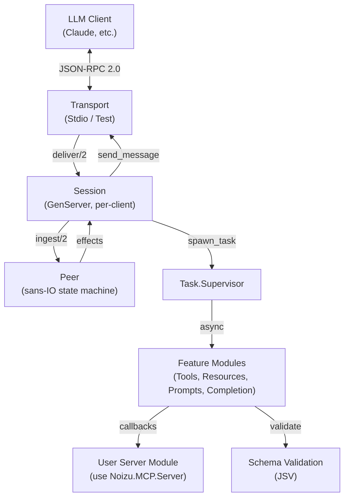

# Project Architecture

## Overview

Noizu MCP is an Elixir library implementing the [Model Context Protocol](https://modelcontextprotocol.io) (MCP) — a JSON-RPC 2.0-based protocol for exposing tools, resources, and prompts to LLM clients like Claude. The library provides a macro-driven DSL for defining MCP servers and a sans-IO state machine (`Peer`) that separates protocol logic from transport concerns.

## System Diagram

## Core Components

| Component | Module | Purpose |
|-----------|--------|---------|
| Server DSL | `Noizu.MCP.Server` | Behaviour + macros for defining MCP servers |
| Session | `Noizu.MCP.Server.Session` | Per-client GenServer managing protocol state |
| Peer | `Noizu.MCP.Peer` | Sans-IO state machine for JSON-RPC handshake and message routing |
| JSON-RPC | `Noizu.MCP.JsonRpc` | Encode/decode JSON-RPC 2.0 messages (no batching) |
| Transport | `Noizu.MCP.Transport` | Server/client transport behaviours |
| Schema | `Noizu.MCP.Schema` | JSV-backed JSON Schema validation with persistent_term cache |
| Features | `Noizu.MCP.Server.Features.*` | Dispatch logic for tools, resources, prompts, completion |
| Types | `Noizu.MCP.Types.*` | Structs for protocol objects (Tool, Resource, Prompt, Content) |

## Supervision Tree

Each `use Noizu.MCP.Server` module becomes a supervisor with this shape:

→ *See [arch/supervision.md](arch/supervision.md) for details*

## Request Lifecycle

Inbound messages flow through: Transport → Session → Peer (effects) → Task.Supervisor → Feature module → User callback. Responses travel back through Session → Transport.

→ *See [arch/request-lifecycle.md](arch/request-lifecycle.md) for details*

## Sans-IO Peer Design

`Noizu.MCP.Peer` is a pure state machine that never touches sockets or processes. It ingests decoded JSON-RPC messages and returns a list of effects (`{:send, msg}`, `{:dispatch, method, id, params}`, `{:ready, info}`, etc.). This makes the protocol logic fully testable without transports.

→ *See [arch/peer.md](arch/peer.md) for details*

## Key Decisions

- **Sans-IO Peer**: Protocol logic is a pure state machine returning effects, decoupled from transport and concurrency. Enables deterministic testing.
- **Macro DSL + Behaviour escape hatch**: The `tool/resource/prompt` macros generate `handle_*` callback implementations, but users can implement the behaviour directly for full control.
- **Task-per-request**: Handler code runs in supervised tasks, not the session process. Keeps ping, cancellation, and progress responsive during long-running tool calls.
- **Capability auto-derivation**: Server capabilities are computed at compile time from registered components; no manual capability map needed.
- **Schema caching**: Compiled JSON Schemas are stored in `:persistent_term` to avoid rebuild cost on repeated validations.

## Technology Stack

| Layer | Choice |
|-------|--------|
| Language | Elixir ~> 1.18 |
| JSON | Jason |
| JSON Schema | JSV (JSON Schema Validator) |
| Concurrency | GenServer + Task.Supervisor + DynamicSupervisor |
| Transport | Stdio (production), in-process (test) |
| Spec versions | 2025-03-26, 2025-06-18, 2025-11-25, draft 2026-07-28-rc |
