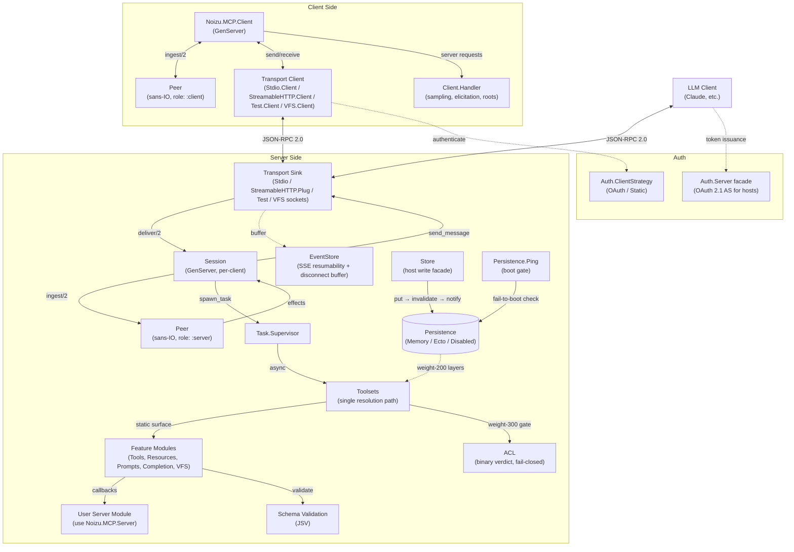

# Project Architecture

## Overview

Noizu MCP is an Elixir library implementing the [Model Context Protocol](https://modelcontextprotocol.io) (MCP) — a JSON-RPC 2.0-based protocol for exposing tools, resources, and prompts to LLM clients like Claude. The library provides both a **server** DSL (`use Noizu.MCP.Server`) and a **client** GenServer (`Noizu.MCP.Client`) sharing a common sans-IO state machine (`Peer`) that separates protocol logic from transport concerns.

On top of the protocol core sits a frozen extension architecture (0.3.0): **toolsets** (single resolution path for every tool surface), **authorization** (binary-verdict ACL over a host-implemented policy seam), **persistence** (pluggable providers for lib-owned toolset/grant/consent state), plus a **virtual filesystem** with mount clients, per-render-context **descriptions** with an inline `@eval` grading harness, and an OAuth 2.1 **authorization-server facade** for hosts.

## System Diagram

```mermaid
graph TB
    LLM["LLM Client<br/>(Claude, etc.)"]

    subgraph "Server Side"
        STransport["Transport Sink<br/>(Stdio / StreamableHTTP.Plug / Test / VFS sockets)"]
        Session["Session<br/>(GenServer, per-client)"]
        SPeer["Peer<br/>(sans-IO, role: :server)"]
        Toolsets["Toolsets<br/>(single resolution path)"]
        Acl["ACL<br/>(binary verdict, fail-closed)"]
        Features["Feature Modules<br/>(Tools, Resources, Prompts, Completion, VFS)"]
        UserServer["User Server Module<br/>(use Noizu.MCP.Server)"]
        EventStore["EventStore<br/>(SSE resumability + disconnect buffer)"]
        Store["Store<br/>(host write facade)"]
        Persistence[("Persistence<br/>(Memory / Ecto / Disabled)")]
        BootGate["Persistence.Ping<br/>(boot gate)"]
        TaskSup["Task.Supervisor"]
        Schema["Schema Validation<br/>(JSV)"]
    end

    subgraph "Client Side"
        Client["Noizu.MCP.Client<br/>(GenServer)"]
        CPeer["Peer<br/>(sans-IO, role: :client)"]
        CTransport["Transport Client<br/>(Stdio.Client / StreamableHTTP.Client / Test.Client / VFS.Client)"]
        Handler["Client.Handler<br/>(sampling, elicitation, roots)"]
    end

    subgraph "Auth"
        AuthStrategy["Auth.ClientStrategy<br/>(OAuth / Static)"]
        AuthFacade["Auth.Server facade<br/>(OAuth 2.1 AS for hosts)"]
    end

    LLM <-->|JSON-RPC 2.0| STransport
    LLM -.->|token issuance| AuthFacade
    STransport -->|deliver/2| Session
    Session -->|ingest/2| SPeer
    SPeer -->|effects| Session
    Session -->|spawn_task| TaskSup
    TaskSup -->|async| Toolsets
    Toolsets -->|static surface| Features
    Features -->|callbacks| UserServer
    Features -->|validate| Schema
    Toolsets -->|weight-300 gate| Acl
    Persistence -.->|weight-200 layers| Toolsets
    Store -->|put → invalidate → notify| Persistence
    BootGate -->|fail-to-boot check| Persistence
    STransport -.->|buffer| EventStore
    Session -->|send_message| STransport

    Client <-->|ingest/2| CPeer
    Client <-->|send/receive| CTransport
    CTransport <-->|JSON-RPC 2.0| STransport
    Client -->|server requests| Handler
    CTransport -.->|authenticate| AuthStrategy
```

## Core Components

| Component | Module | Purpose |
|-----------|--------|---------|
| Server DSL | `Noizu.MCP.Server` | Behaviour + macros for defining MCP servers |
| Client | `Noizu.MCP.Client` | GenServer wrapping Peer for connecting to MCP servers |
| Client Handler | `Noizu.MCP.Client.Handler` | Behaviour for sampling, elicitation, roots callbacks |
| Session | `Noizu.MCP.Server.Session` | Per-client GenServer managing server-side protocol state |
| Peer | `Noizu.MCP.Peer` | Sans-IO state machine for JSON-RPC handshake and message routing |
| JSON-RPC | `Noizu.MCP.JsonRpc` | Encode/decode JSON-RPC 2.0 messages (no batching) |
| Transport (server) | `Noizu.MCP.Transport` | Server sink behaviour — Stdio, StreamableHTTP.Plug, Test, VFS sockets |
| Transport (client) | `Noizu.MCP.Transport.Client` | Client transport behaviour — Stdio.Client, StreamableHTTP.Client, Test.Client, VFS.Client |
| Toolsets | `Noizu.MCP.Toolset` | Single resolution path (catalog/resolve/invoke/permissions) for all tool surfaces |
| ACL | `Noizu.MCP.ACL` | Binary-verdict authorization protocol over a host policy seam (PRD-2) |
| Principal | `Noizu.MCP.Auth.Principal` | Typed request identity — the authorization subject |
| Persistence | `Noizu.MCP.Persistence` | Provider contract for lib-owned toolset/grant/consent stores (PRD-4) |
| Store | `Noizu.MCP.Store` | Host write facade: put → version bump → cache invalidate → notify fan-out |
| Permission | `Noizu.MCP.Permission` | Persisted `%Grant{}` / `%Negotiation{}` records — weight-200 merge layers |
| Migrations | `Noizu.MCP.Migrations` + `Migration.Runner` | Oban-shaped change-set runner + shipped v1 Postgres DDL |
| VFS | `Noizu.MCP.VFS` | Virtual filesystem behaviour, TTL cache, `/etc/dev` control tree |
| Auth | `Noizu.MCP.Auth.*` | OAuth 2.1 client strategies, token verifiers, `Auth.Server` AS facade |
| Schema | `Noizu.MCP.Schema` | JSV-backed JSON Schema validation with persistent_term cache |
| EventStore | `Noizu.MCP.Server.EventStore` | Bounded ETS ring buffer for SSE resumability + disconnect survival |
| Features | `Noizu.MCP.Server.Features.*` | Dispatch logic for tools, resources, prompts, completion, vfs |
| Types | `Noizu.MCP.Types.*` | Structs for protocol objects (Tool, Resource, Prompt, Root, Content) |
| Descriptions | `Noizu.MCP.Description` / `RenderCtx` | Per-render-context tool descriptions with verbosity variants |
| Eval | `Noizu.MCP.Eval` | Inline `@eval` rubric harness grading rendered descriptions |
| Inspector | `Noizu.MCP.Inspector` | Localhost-only HTML dev client; launched via `mix mcp.client` |

→ *Components ↔ directories: see [PROJ-LAYOUT.md](PROJ-LAYOUT.md); detail docs under [arch/](layout/docs.md)*

## Authorization

`Noizu.MCP.ACL` is a binary-verdict protocol (`check/5 → :allow | :deny`) over a `ACL.Provider` seam the host implements; the library owns no policy. Enforcement is a chokepoint (`filter_entries/4`) inside the toolset behaviour, so feature shims cannot bypass it. Persisted `%Grant{}`/`%Negotiation{}` records fold into the merge at weight 200 (adjust/extend, never hide); ACL gates visibility at weight 300. Denials are silent (anti-oracle); consent-gated tools stay listed but resolve to one honest `:forbidden`.

→ *See [arch/authorization.md](arch/authorization.md) for details*

## Persistence & Migrations

Lib-owned stores (`toolsets`, `toolset_grants`, `toolset_negotiations`) sit behind a provider contract — `Memory` (ETS, default), `Ecto` (Postgres), `Disabled` (a no-layers policy). Providers are selected lazily per call (D3); writes go only through the `Store` facade (put → cache invalidate → best-effort notify, D5). A boot-gate child pings external providers and **fails the server boot** on a misconfigured store (D4). Tables ship as raw-SQL change sets applied by an Oban-shaped `Migration.Runner`.

→ *See [arch/persistence.md](arch/persistence.md) for details*

## Toolset Resolution

All tool-surface consumers (`tools/list`, `tools/call`, catalog) flow through one protocol: `catalog/resolve/invoke/permissions`. Implementations materialize the **effective** surface before validation and wire rendering; composition (base + include/exclude + closed-vocabulary overrides) is weighted-merged in behaviour impls (`Merge.fold/2`). Unknown participants fail closed; a broken toolset disables itself, not the server (D5).

→ *See [arch/toolsets.md](arch/toolsets.md) for details*

## Virtual Filesystem

`Noizu.MCP.VFS` exposes backends as a node tree with errno-mapped errors and version-stamped nodes; a `:persistent_term` TTL cache (generation-keyed) sits over stat/list/read, and an `/etc/dev` control tree composes into every backend for introspection and runtime toggles. Transports mount `vfs/*` extension ops over unix sockets and WebSocket; the `daemon/mcp_mount` escript mounts a server as real local files with bidirectional sync.

→ *See [arch/vfs.md](arch/vfs.md) for details*

## Supervision Tree

Each `use Noizu.MCP.Server` module becomes a supervisor: Registry, Task.Supervisor, DynamicSupervisor (sessions), EventStore, then persistence children (boot gate, conditional), then transport (stdio / vfs_socket). One persistence resolution per server is made at boot and stashed in `:persistent_term`.

→ *See [arch/supervision.md](arch/supervision.md) for details*

## Transport Layer

Three core server/client transport pairs, plus VFS-specific transports:

| Transport | Server | Client | Wire format |
|-----------|--------|--------|-------------|
| Stdio | `Transport.Stdio` | `Transport.Stdio.Client` | Newline-delimited JSON-RPC over stdin/stdout |
| Streamable HTTP | `Transport.StreamableHTTP.Plug` | `Transport.StreamableHTTP.Client` | POST/GET/DELETE with SSE upgrade, `Mcp-Session-Id` |
| Test (in-process) | `Transport.Test` | `Transport.Test.Client` | Direct message passing in the same VM |
| VFS (local mount) | `Transport.VFS.Socket` / `VFS.WS` | `Transport.VFS.Client` | Length-prefixed JSON-RPC (unix socket) / WebSocket `GET /vfs` |

SSE encoding/parsing is handled by `Transport.SSE`. Every outbound message is appended to the EventStore even when routed to a live stream; when no stream is live the Sink buffers it there (causative POST stream → session GET stream → buffer), so chunks emitted during a client disconnect survive and replay via `Last-Event-ID`.

→ *See [arch/transports.md](arch/transports.md) for details*

## Request Lifecycle

Inbound messages flow through: Transport → Session → Peer (effects) → Task.Supervisor → Feature module → User callback. Tool surfaces resolve through the Toolset protocol (static base → weight-200 persisted layers → weight-300 ACL gating); consent-gated invocations resolve to one honest `:forbidden`, ACL-hidden tools are indistinguishable from absent ones. Responses travel back through Session → Transport.

→ *See [arch/request-lifecycle.md](arch/request-lifecycle.md) for details*

## Client Architecture

`Noizu.MCP.Client` is a GenServer that wraps the same `Peer` state machine (in `:client` role). It manages transport lifecycle, queues calls made before the handshake completes, and dispatches server-initiated requests (sampling, elicitation) to the user's `Client.Handler` module.

→ *See [arch/client.md](arch/client.md) for details*

## Inspector Subsystem

`Noizu.MCP.Inspector` is a Supervisor: Registry + DynamicSupervisor for per-browser sessions, plus a Bandit HTTP server bound to `127.0.0.1`. Each session owns a `Noizu.MCP.Client` wrapped in `Inspector.TapTransport` (mirrors raw frames for the History tab); `Inspector.Handler` parks sampling/elicitation until the browser responds via REST. Events stream over per-session SSE backed by a 500-event ring buffer; auth is a random per-run bearer token + localhost `Origin` check. Launched via `mix mcp.client` (see [guides/inspector.md](../guides/inspector.md)).

## Sans-IO Peer Design

`Noizu.MCP.Peer` is a pure state machine that never touches sockets or processes. It ingests decoded JSON-RPC messages and returns a list of effects (`{:send, msg}`, `{:dispatch, method, id, params}`, `{:ready, info}`, etc.). Shared between server and client roles.

→ *See [arch/peer.md](arch/peer.md) for details*

## Authentication

Client-side, the `Auth.ClientStrategy` behaviour (implementations: `Auth.OAuth` — full OAuth 2.1 with PKCE and RFC 9728 discovery; `Auth.Static` — bearer token) plugs into the Streamable HTTP client transport. Server-side, a token-verifier family (`TokenVerifier`, `ApiKeyVerifier`, `ChainVerifier`, `JwtVerifier`, `CompoundJwtVerifier`) validates bearers, and `Auth.Server` is an OAuth 2.1 **authorization-server facade** in front of the host's existing IdP: the facade owns client registry (RFC 7591 DCR + CIMD), consent, and token issuance; authenticating the human delegates to the host's own login.

→ *See [arch/auth.md](arch/auth.md) for details*

## Descriptions & Eval

Anywhere a description string is expected, a variant list works instead: `{:verbosity, levels}` entries with `default:` fallback, named `descriptions:`, `verbosity_map:`, and model/provider `runners:` — all compile-time validated, with nearest-level gap-fill for uncovered verbosity (0–9). `RenderCtx` threads the knobs through every render site. `@eval` annotations attach name/prompt/rubric specs to tools; `mix noizu.mcp.eval` renders descriptions across model × verbosity permutations and grades them via pluggable `Eval.Runner`/`Eval.Judge` (deterministic no-LLM stubs ship for CI).

## Key Decisions

- **Sans-IO Peer**: Protocol logic is a pure state machine returning effects, decoupled from transport and concurrency. Enables deterministic testing.
- **Shared Peer for client and server**: Both roles use the same state machine; role-specific behavior is a parameter, not a separate implementation.
- **Macro DSL + Behaviour escape hatch**: The `tool/resource/prompt` macros generate `handle_*` callback implementations, but users can implement the behaviour directly for full control.
- **Task-per-request**: Handler code runs in supervised tasks, not the session process. Keeps ping, cancellation, and progress responsive during long-running tool calls.
- **Capability auto-derivation**: Server capabilities are computed at compile time from registered components (incl. `vfs_write` from backend implementation); client capabilities from implemented `Handler` callbacks.
- **Schema caching**: Compiled JSON Schemas are stored in `:persistent_term` to avoid rebuild cost on repeated validations.
- **EventStore for resumability**: Outbound messages buffer in a bounded ETS ring buffer so `Last-Event-ID` reconnects never miss events — including chunks emitted while the client was disconnected.
- **Fail-closed seams (PRD-2/PRD-4)**: The lib owns no ACL policy and no `Any` fallback; unknown participants raise. No provider configured ⇒ inert `:allow` (zero-change for existing hosts).
- **Single resolution path (D1)**: every tool-surface consumer goes through the Toolset protocol — no side doors, one merge semantics, anti-oracle error identity for hidden tools.
- **Lazy reads, best-effort writes (D3/D5)**: providers resolve per call; post-write fan-out failures are logged, never raised — a completed write never reports failure.
- **Fail-to-boot (D4)**: a persistence store that cannot answer its boot ping refuses to start the server rather than silently degrading.
- **Interface freeze**: 0.3.0 froze the toolset/ACL/persistence interfaces; changes require an ADR and a 0.4.0.

## Technology Stack

| Layer | Choice |
|-------|--------|
| Language | Elixir ~> 1.18 |
| JSON | Jason |
| JSON Schema | JSV (JSON Schema Validator) |
| HTTP Server | Plug + Bandit (optional, for Streamable HTTP and Inspector) |
| HTTP Client | Req (optional, for Streamable HTTP, OAuth, CIMD) |
| Persistence | In-memory ETS (default); optional Postgres via Ecto provider |
| Schema migrations | `Migration.Runner` change sets (Oban-shaped host delegation); OAuth AS tables via `priv/liquibase/` |
| Concurrency | GenServer + Task.Supervisor + DynamicSupervisor |
| Transports | Stdio, Streamable HTTP (POST/GET/DELETE + SSE), in-process test, VFS unix-socket/WebSocket |
| Auth | OAuth 2.1 (PKCE + RFC 9728), static bearer, JWT verifiers, AS facade |
| Companion tools | `mix mcp.client` (inspector), `mix mcp.eval` (description grading), `daemon/mcp_mount` (VFS mount escript) |
| Spec versions | 2025-03-26, 2025-06-18, 2025-11-25, draft 2026-07-28-rc |
