# Project Schema

Data-model reference for `noizu_mcp`. **The library owns no database** — every
SQL artifact below is shipped for the *host* to apply. Two application paths:

| Group | Applied by | Artifact | Detail |
|---|---|---|---|
| Lib-owned toolset/persistence tables | `Noizu.MCP.Migrations.Runner` (host Repo, Oban shape) | `lib/noizu/mcp/migrations/v1_toolsets.ex` (raw DDL, idempotent) | [schema/toolsets.md](schema/toolsets.md) |
| OAuth 2.1 AS tables | Host, via Liquibase template | `priv/liquibase/noizu_mcp_oauth.yaml` | [schema/oauth.md](schema/oauth.md) |
| Agent keypair/password auth tables | Host, via Liquibase template | `priv/liquibase/noizu_mcp_agent.yaml` | [schema/agent.md](schema/agent.md) |
| Sync schema (`mcp_sync`, ADR-009/PRD-13) | Host admin role, via Liquibase | `priv/liquibase/noizu_mcp_sync.yaml` → `priv/sql/noizu_mcp_sync.sql` | [schema/sync.md](schema/sync.md) |

Liquibase changelogs are the authoritative source; this doc mirrors them.
Code layout: see [PROJ-LAYOUT.md](PROJ-LAYOUT.md).

## Conventions (all groups)

- Timestamps: `inserted_at` / `updated_at` `timestamptz NOT NULL DEFAULT now()`
  (`clock_timestamp()` in `mcp_sync`); app code manages UTC.
- Secrets are never stored plaintext: hash columns are SHA-256 hex `char(64)`
  (except `clients.secret_hash` and agent `password_hash`/`recovery_hashes`,
  which hold caller-hashed Argon2/PBKDF2 strings).
- Single-use/redemption atomicity via `UPDATE … WHERE used_at IS NULL RETURNING *`
  (auth codes, agent session nonces) and `INSERT … ON CONFLICT DO NOTHING RETURNING`
  (assertion JTI replay guard).
- Postgres 14+; `gen_random_uuid()` where uuid PKs are used.

## Entity relationships (all groups)

```mermaid
erDiagram
    noizu_mcp_toolsets ||--o{ noizu_mcp_toolset_grants : "slug (logical, no FK)"
    noizu_mcp_toolsets ||--o{ noizu_mcp_toolset_negotiations : "slug (logical, no FK)"
    mcp_oauth_clients ||--o{ mcp_oauth_authorization_codes : ""
    mcp_oauth_clients ||--o{ mcp_oauth_refresh_tokens : ""
    mcp_oauth_refresh_tokens |o--o| mcp_oauth_refresh_tokens : "rotated_to (rotation chain)"
    mcp_oauth_clients ||--o{ mcp_oauth_consents : ""
    mcp_oauth_clients ||--o{ mcp_oauth_access_tokens : "optional (track_access_tokens)"
    mcp_agent_accounts ||--o{ mcp_agent_account_keys : ""
    mcp_agent_accounts ||--o| mcp_agent_credentials : ""
    mcp_agent_accounts ||--o{ mcp_agent_sessions : ""
    mcp_agent_accounts ||--o{ mcp_agent_account_events : ""
    mcp_sync_bindings ||--o{ mcp_sync_records : ""
    mcp_sync_records ||--o{ mcp_sync_outbox : ""
    mcp_sync_outbox |o--o{ mcp_sync_conflicts : "one open per operation"
    mcp_sync_bindings ||--o{ mcp_sync_checkpoints : ""
    mcp_sync_bindings ||--o{ mcp_sync_inbound_deferred : ""
    mcp_sync_bindings ||--o{ mcp_sync_source_heads : ""
    mcp_sync_bindings ||--o{ mcp_sync_source_records : ""
    mcp_sync_bindings ||--o{ mcp_sync_source_changes : ""
    mcp_sync_bindings ||--o{ mcp_sync_source_operations : ""
    mcp_sync_bindings ||--o{ mcp_sync_source_snapshots : ""
```

```plantuml
@startuml
skinparam linetype ortho

package "lib-owned (Runner v1)" {
  entity noizu_mcp_toolsets
  entity noizu_mcp_toolset_grants
  entity noizu_mcp_toolset_negotiations
  entity noizu_mcp_store_versions
  entity noizu_mcp_engine_servers
}
package "OAuth 2.1 AS (template)" {
  entity mcp_oauth_clients
  entity mcp_oauth_login_states
  entity mcp_oauth_authorization_codes
  entity mcp_oauth_refresh_tokens
  entity mcp_oauth_consents
  entity mcp_oauth_access_tokens
}
package "Agent auth (template)" {
  entity mcp_agent_accounts
  entity mcp_agent_account_keys
  entity mcp_agent_credentials
  entity mcp_agent_sessions
  entity mcp_agent_assertion_jti
  entity mcp_agent_account_events
}
package "mcp_sync (ADR-009)" {
  entity mcp_sync_bindings
  entity mcp_sync_records
  entity mcp_sync_outbox
  entity mcp_sync_conflicts
  entity mcp_sync_checkpoints
  entity mcp_sync_inbound_deferred
  entity mcp_sync_source_heads
  entity mcp_sync_source_records
  entity mcp_sync_source_changes
  entity mcp_sync_source_operations
  entity mcp_sync_source_snapshots
}

noizu_mcp_toolsets ||--o{ noizu_mcp_toolset_grants
noizu_mcp_toolsets ||--o{ noizu_mcp_toolset_negotiations
mcp_oauth_clients ||--o{ mcp_oauth_authorization_codes
mcp_oauth_clients ||--o{ mcp_oauth_refresh_tokens
mcp_oauth_refresh_tokens |o--o| mcp_oauth_refresh_tokens : rotated_to
mcp_oauth_clients ||--o{ mcp_oauth_consents
mcp_oauth_clients ||--o{ mcp_oauth_access_tokens
mcp_agent_accounts ||--o{ mcp_agent_account_keys
mcp_agent_accounts ||--o| mcp_agent_credentials
mcp_agent_accounts ||--o{ mcp_agent_sessions
mcp_agent_accounts ||--o{ mcp_agent_account_events
mcp_sync_bindings ||--o{ mcp_sync_records
mcp_sync_records ||--o{ mcp_sync_outbox
mcp_sync_outbox |o--o{ mcp_sync_conflicts
mcp_sync_bindings ||--o{ mcp_sync_checkpoints
mcp_sync_bindings ||--o{ mcp_sync_inbound_deferred
mcp_sync_bindings ||--o{ mcp_sync_source_heads
mcp_sync_bindings ||--o{ mcp_sync_source_records
mcp_sync_bindings ||--o{ mcp_sync_source_changes
mcp_sync_bindings ||--o{ mcp_sync_source_operations
mcp_sync_bindings ||--o{ mcp_sync_source_snapshots
@enduml
```

## Table inventory

| Table | PK | Group | One-line purpose |
|---|---|---|---|
| `noizu_mcp_toolsets` | `slug text` | lib | Persisted custom toolset: base + include/exclude + overrides |
| `noizu_mcp_toolset_grants` | `id text` | lib | Per-authenticator/subject allow-deny grant with scopes |
| `noizu_mcp_toolset_negotiations` | `id text` | lib | Pending per-tool scope negotiation records |
| `noizu_mcp_store_versions` | `store_key text` | lib | Monotonic version counter per store key (write facade) |
| `noizu_mcp_engine_servers` | `name text` | lib | Engine federation upstream registry (PRD-11) |
| `noizu_mcp_schema_versions` | — | lib | Runner's own migration ledger (bootstrap-created, not in v1 set) |
| `mcp_oauth_clients` | `client_id text` | oauth | Registered / RFC 7591 dynamic / CIMD clients |
| `mcp_oauth_login_states` | `state_hash char(64)` | oauth | IdP round-trip state + consent CSRF (short-lived) |
| `mcp_oauth_authorization_codes` | `code_hash char(64)` | oauth | Single-use auth codes, PKCE S256-only |
| `mcp_oauth_refresh_tokens` | `id uuid` (`token_hash` uq) | oauth | Rotating refresh tokens with family reuse-detection |
| `mcp_oauth_consents` | `id uuid` (uq subject+client) | oauth | Granted scope per subject/client (re-prompt boundary) |
| `mcp_oauth_access_tokens` | `jti_hash char(64)` | oauth | OPTIONAL — only with `track_access_tokens: true` |
| `mcp_agent_accounts` | `id text` | agent | Anonymous-but-tracked keypair/password accounts |
| `mcp_agent_account_keys` | `fingerprint text` | agent | Ed25519 public keys (globally unique, revoked not deleted) |
| `mcp_agent_credentials` | `account_id text` | agent | Human password + recovery-code hashes (1:1) |
| `mcp_agent_sessions` | `id_hash char(64)` | agent | Anonymous pre-auth sessions (hashed id+nonce, atomic consume) |
| `mcp_agent_assertion_jti` | `jti_hash char(64)` | agent | SETNX-shaped assertion replay guard |
| `mcp_agent_account_events` | `id uuid` | agent | Append-only audit log (no update path) |
| `mcp_sync.bindings` | `id uuid` (uq tenant/source/principal/relation) | sync | Principal-bound source binding + access mode/capabilities |
| `mcp_sync.records` | `(binding_id, resource_key)` | sync | Local revisioned dataset rows (CAS via expected_local_revision) |
| `mcp_sync.outbox` | `operation_id uuid` | sync | Durable outbound ops: fencing token, lease, retries |
| `mcp_sync.conflicts` | `id uuid` | sync | Remote-vs-local conflict records (one open per operation) |
| `mcp_sync.checkpoints` | `binding_id uuid` | sync | Change-feed cursor / snapshot resumption per binding |
| `mcp_sync.inbound_deferred` | `(binding_id, event_id)` | sync | Out-of-order inbound events held until apply |
| `mcp_sync.source_heads` | `binding_id uuid` | sync | Controlled-source head counter + retention |
| `mcp_sync.source_records` | `(binding_id, resource_key)` | sync | Source-side projection (controlled PG Source) |
| `mcp_sync.source_changes` | `(binding_id, counter)` | sync | Source change feed (tombstoning) |
| `mcp_sync.source_operations` | `(binding_id, operation_id)` | sync | Source idempotency ledger (request_hash + outcome) |
| `mcp_sync.source_snapshots` | `id uuid` | sync | Consistent snapshot blobs (15-min default expiry) |

Column-level detail, indexes, constraints, and the `mcp_sync` RLS/trigger
machinery: see the `schema/` files linked in the first table.

## Non-relational data

- **MCP JSON Schema** — `priv/spec/2025-11-25/schema.json`: official spec
  schema; `Noizu.MCP.Schema` validates wire messages against it (JSV,
  JSON Schema 2020-12). Spec snapshots + changelogs under `docs/specs/`,
  `docs/07–09-*.md`.
- **Default persistence is in-memory** — `Noizu.MCP.Persistence.Memory`: one
  lazily-created public ETS table; no SQL involved unless the host wires the
  Ecto provider.
- **VFS** — runtime tree-shaped (paths → entries) over backends, not persisted;
  see `docs/arch/vfs.md`.
