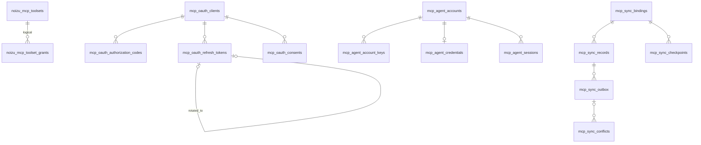

# Project Schema Summary

Library owns no database — all SQL is shipped for the host to apply. Full
detail: [PROJ-SCHEMA.md](PROJ-SCHEMA.md) + `schema/` files.

| Group | Applied by | Artifact |
|---|---|---|
| Lib-owned toolset tables | Migrations.Runner (host Repo) | `lib/noizu/mcp/migrations/v1_toolsets.ex` |
| OAuth 2.1 AS | Liquibase template | `priv/liquibase/noizu_mcp_oauth.yaml` |
| Agent keypair/password auth | Liquibase template | `priv/liquibase/noizu_mcp_agent.yaml` |
| Sync (ADR-009) | Liquibase (admin role) | `priv/liquibase/noizu_mcp_sync.yaml` + `priv/sql/noizu_mcp_sync.sql` |

```
noizu_mcp_toolsets            slug PK                     custom toolsets
noizu_mcp_toolset_grants      id PK                       allow/deny grants
noizu_mcp_toolset_negotiations id PK                      scope negotiations
noizu_mcp_store_versions      store_key PK                version counters
noizu_mcp_engine_servers      name PK                     federation registry
noizu_mcp_schema_versions     (Runner ledger)             migration ledger
mcp_oauth_clients             client_id PK                registered/dynamic/CIMD
mcp_oauth_login_states        state_hash PK               IdP round-trip state
mcp_oauth_authorization_codes code_hash PK                single-use, PKCE S256
mcp_oauth_refresh_tokens      id PK, token_hash UQ        rotation + family reuse-detect
mcp_oauth_consents            id PK, uq(subject,client)   granted scope
mcp_oauth_access_tokens       jti_hash PK                 optional (track_access_tokens)
mcp_agent_accounts            id PK, uq lower(handle)     keypair/password accounts
mcp_agent_account_keys        fingerprint PK              Ed25519 keys, revoked-kept
mcp_agent_credentials         account_id PK               1:1 password/recovery hashes
mcp_agent_sessions            id_hash PK                  pre-auth, atomic consume
mcp_agent_assertion_jti       jti_hash PK                 replay guard (SETNX)
mcp_agent_account_events      id PK                       append-only audit
mcp_sync.bindings             id PK, uq(tenant,source,principal,relation)
mcp_sync.records              (binding_id, resource_key)  CAS revisioned rows
mcp_sync.outbox               operation_id PK             durable ops, fencing, lease
mcp_sync.conflicts            id PK                       one open per operation
mcp_sync.checkpoints          binding_id PK               feed cursor/snapshot resume
mcp_sync.inbound_deferred     (binding_id, event_id)      out-of-order inbound
mcp_sync.source_heads         binding_id PK               controlled-source head
mcp_sync.source_records       (binding_id, resource_key)  source projection
mcp_sync.source_changes       (binding_id, counter)       change feed
mcp_sync.source_operations    (binding_id, operation_id)  idempotency ledger
mcp_sync.source_snapshots     id PK                       15-min snapshots
```



Conventions: `inserted_at`/`updated_at` timestamptz; SHA-256 hex `char(64)`
hash columns (Argon2/PBKDF2 for caller-hashed passwords); Postgres 14+;
`mcp_sync` tables under FORCE RLS with SECURITY DEFINER access guards.
