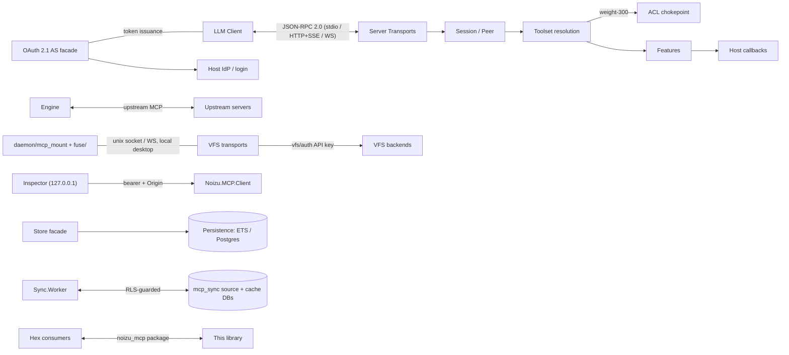

# Threat Model

Security counterpart to [PROJ-ARCH.md](PROJ-ARCH.md). Grounded in the arch
docs (`arch/`), the schema reference ([PROJ-SCHEMA.md](PROJ-SCHEMA.md)), and
verified against code under `lib/` (see [PROJ-LAYOUT.md](PROJ-LAYOUT.md)).

## Overview

`noizu_mcp` is a **library**, not a deployment: it has no perimeter of its own.
The assets it must protect are (1) the host's MCP tool surface — the authority
to invoke tools and read resources, (2) credentials crossing the wire or held
in host stores (OAuth tokens, API keys, Ed25519 keypairs), and (3) host data
reachable through VFS mounts, the Engine's upstream connections, and the
`mcp_sync` databases. Trust boundaries: **LLM client ↔ server transport**,
**host app ↔ library seams** (ACL, persistence, auth verifiers), **server ↔
upstream MCP servers** (Engine), **library ↔ local desktop** (VFS mount
daemons, Inspector), **app roles ↔ PostgreSQL** (sync), and **packaging ↔
consumers** (Hex supply chain).

Design posture: fail-closed seams, hashed-at-rest credentials, anti-oracle
error identity, and database-enforced correctness for synchronization. Where
security is the **host's** decision (policy, TLS, credential storage), the
library provides the mechanism and documents the obligation — those appear in
the register as *host responsibility*, never as silently-mitigated.

## Attack Surface

→ *See [threats/attack-surface.md](threats/attack-surface.md) for the full
ingress/egress/store enumeration*

## Vulnerability Register

| ID | Severity | STRIDE | Component | Status |
|----|----------|--------|-----------|--------|
| T-001 | High | Spoofing | Streamable HTTP server surface — unauthenticated callers reaching tools | Mitigated: token-verifier family + `Auth.Server` AS facade (PKCE S256-only, access-token TTL ≤ 900s); wiring it is host responsibility |
| T-002 | High | Spoofing | OAuth token replay (codes, refresh rotation, assertion JTIs) | Mitigated: atomic `used_at` redemption, family-wide revocation on rotation replay, SETNX JTI guard |
| T-003 | High | Info disclosure | Credential material at rest | Mitigated: SHA-256 hex / Argon2-PBKDF2 hashing convention in all shipped schemas; no plaintext columns |
| T-004 | High | Elevation | Tool invocation bypassing authorization | Mitigated: single toolset resolution path; ACL chokepoint (`filter_entries/4`) cannot be bypassed by feature shims |
| T-005 | Medium | Info disclosure | ACL as an oracle (tool existence/policy inference) | Mitigated: silent denials; hidden tools indistinguishable from absent ones (identical error) |
| T-006 | Medium | Elevation | No ACL provider wired by host | Open by design: no provider ⇒ inert `:allow` (documented back-compat); host responsibility |
| T-007 | Medium | Tampering | Sync write races / lost updates / stale worker leases | Mitigated in-database: CAS via `expected_local_revision`, fencing tokens, outbox leases, FORCE RLS + SECURITY DEFINER guards |
| T-008 | Medium | Elevation | Sync principal/relation derived from request params | Mitigated by contract (server-controlled state, host-resolved principal) — enforcement is host code; audit when adding sources |
| T-009 | Low | Info disclosure | Inspector dev surface | Mitigated: 127.0.0.1 bind, per-run random bearer, localhost `Origin` check; residual: any local process/user |
| T-010 | Medium | Spoofing/Tampering | VFS mount daemons on the local desktop | Partial: `vfs/auth` API-key handshake on sockets; unix-socket exposure rides on filesystem permissions — host/operator must restrict socket dirs |
| T-011 | Medium | DoS | Long-running tools, SSE floods, session exhaustion | Mitigated: task-per-request supervision with cancellation, bounded EventStore ring, no JSON-RPC batching; transport hardening (timeouts, body limits) is host/plug responsibility |
| T-012 | Medium | Tampering | Supply chain (Hex package, CI, shipped SQL templates) | Partial: locked deps (`mix.lock`), 2FA publish discipline, raw-SQL templates are reviewed artifacts; no artifact signing |
| T-013 | Low | Info disclosure | Crash dumps / logs carrying frames or secrets | Partial: `erl_crash.dump` gitignored; hosts must keep dumps/logs out of shared storage |
| T-014 | Medium | Spoofing | Engine upstream impersonation / credential leakage | Partial: `auth_ref` stored-credential indirection; `passthrough` forwards caller credential — upstream transport authenticity is host responsibility |
| T-015 | Low | Repudiation | Agent account/key lifecycle disputes | Mitigated: append-only `mcp_agent_account_events` (no update path), revoked keys kept |

## Mitigation Coverage

10 mitigated · 3 partial · 1 open-by-design · 1 host-audit. The open-by-design
item (T-006) is the documented inert-allow default; partial items name their
remaining owner above.

→ Control details: [threats/authn-authz.md](threats/authn-authz.md) ·
[threats/sync-and-stores.md](threats/sync-and-stores.md) ·
[threats/local-surface.md](threats/local-surface.md) ·
[threats/supply-chain.md](threats/supply-chain.md)

## Residual Risk

- **Anti-oracle vs. debuggability**: silent ACL denials trade observability for
  non-disclosure; hosts must opt into auditing at their own seam.
- **Local-desktop trust**: the mount daemons and Inspector assume a trusted
  multi-user-locality is out of scope; on a shared machine they are exposure,
  not protection.
- **Experimental surfaces** (`sql/*`, sync v1) carry correctness proofs but a
  shorter field history; treat upstream-derived data as untrusted input at the
  host boundary.
