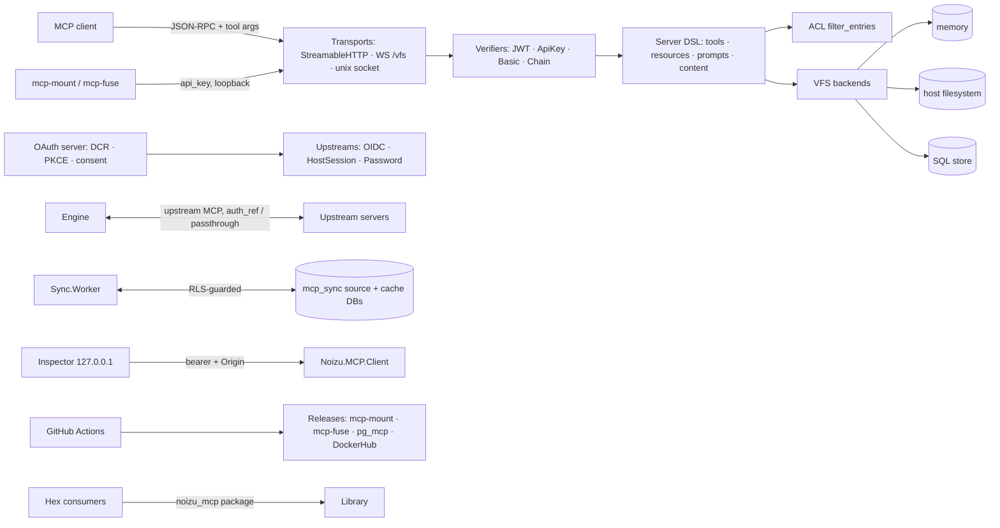

# Threat Model — noizu_mcp (elixir-mcp-lib)

Grounded in code on `develop` + the `epic.content-crud-auth` changeset (review:
w3-review 2026-10-06; CI/publish: ci-scout 2026-10-07) and the 2026-10-07
fleet sweep. This repo has no PROJ-ARCH/PROJ-LAYOUT docs yet, so register
entries cite modules and test files directly. Maintained via
`/npl-update-threat-model`.

> Register provenance: the PR #31 merge resolution dropped the fleet-sweep
> entries (Engine upstream, Inspector, mcp_sync/RLS, and others); they are
> restored below as **T-020…T-033** (renumbered — original IDs T-001…T-015
> collided with the epic-side register; mount-daemon entry folded into
> T-018).

## Overview — assets & trust boundaries

This is a **library, not a deployment**: the jewels are the *correctness of its
security primitives* (token verifiers, OAuth server, ACL chokepoint), the
**confinement of its VFS backends** (a escape from `VFS.File` or
`VFS.Database` is host-filesystem/SQL compromise), and the **artifact
pipeline** (manual hex publish of `noizu_mcp`; `mcp-mount` escript +
`mcp-fuse` binaries + `pg_mcp` pgrx packages via GitHub Releases; DockerHub
image on pg tags). A library vulnerability multiplies into every embedding
host — severity below is rated with that amplification in mind.

Trust boundaries: **(1)** MCP client → transports (untrusted JSON-RPC, tool
args, resource URIs) · **(2)** credential presenter → TokenVerifier · **(3)**
server → VFS backend (memory / host FS / SQL — the sandbox-escape boundary) ·
**(4)** library → upstream IdP (OIDC discovery egress) · **(5)** CI → released
artifacts · **(6)** local daemon ↔ loopback (`mcp-mount`/`mcp-fuse` trust an
api_key on a local socket).

**Host-obligation boundary (explicit, not silence):** store choice and secret
custody, TLS termination, rate limiting/throttling, and cookie/session
handling belong to the embedding application. The library's duty is safe by
default — fail-closed ACL, confined paths, constant-time compares — and
documented seams where it cannot control the host.

## Attack Surface

→ *Control details: [threats/authn-authz.md](threats/authn-authz.md) ·
[threats/sync-and-stores.md](threats/sync-and-stores.md) ·
[threats/local-surface.md](threats/local-surface.md) ·
[threats/supply-chain.md](threats/supply-chain.md) ·
[threats/attack-surface.md](threats/attack-surface.md)*

## Vulnerability Register

| ID | Sev | STRIDE | Component | Finding | Status |
|----|-----|--------|-----------|---------|--------|
| T-001 | Med | Spoofing | `auth/` verifiers | Forged bearer tokens | **Mitigated** — RS256 strict iss/aud/exp (`jwt_verifier`), constant-time ApiKey compare, Chain composition (`test/auth/*`) |
| T-002 | Med | Spoofing | OAuth server | Client spoofing / code interception | **Mitigated** — PKCE, single-use state, DCR `allowed_redirect_hosts` |
| T-003 | Med | Info disclosure | OIDC upstream | SSRF via discovery/metadata URLs | **Mitigated** — confined discovery (`test/auth/ssrf*`) |
| T-004 | High | EoP | `vfs/file.ex` | Path traversal / symlink escape → host FS | **Mitigated** — lexical expand + component-wise resolution; traversal `:enoent`, escape `:eacces` (`test/vfs_file_test.exs` 39/39) |
| T-005 | Med | Tampering | `vfs/database.ex` | SQL injection via VFS paths/URIs | **Mitigated** — parameterized binds only, no interpolation |
| T-006 | Med | EoP | `acl/` | Over-broad access by default | **Mitigated** — fail-closed; ships DenyAll/Disabled/Scopes; `filter_entries/4` chokepoint |
| T-007 | Low | DoS | dynamic_content / prompts | Atom exhaustion via JSON keys | **Mitigated** — string keys kept; `String.to_existing_atom` bounded |
| T-008 | Low | Spoofing | `auth/basic_verifier.ex` | Timing/hash oracle on Basic secrets | **Mitigated** — `Secret.token_hash/1` constant-time compare |
| T-009 | **High** | EoP | `dynamic_content.claim_scopes/1` | Canonical OAuth `"scope"` claim (space-joined) never read → write gate mis-evaluates JWT **and** Basic credentials | **Mitigated** — delegates to `JWTVerifier.scopes/1`; regression tests cover `"scope"`/`"scp"`/Basic-stamped shapes |
| T-010 | Med | EoP | `features/vfs.ex` routing | Content-only server: paths outside declared prefixes reach the content backend ungated (`write_scope` bypass) | **Mitigated** — fallback term-matches plain vfs registrations only; undeclared prefixes on content-only servers rejected (tested) |
| T-011 | Med | Spoofing | `transport/…/plug.ex` | 401 always emits Bearer challenge; `BasicVerifier.challenge/1` (RFC 7617 realm) never wired | **Mitigated** — Basic/Chain-of-Basic failures emit realm-honoring Basic challenge; Bearer/ApiKey/JWT bodies unchanged |
| T-012 | Low-Med | Info disclosure | `vfs/file.ex children/2` | Symlink inside root leaks target size/mtime/type via `vfs_list` (`File.stat` follows links) | **Mitigated** — lstat-based; escaping/dangling links skipped (tested) |
| T-013 | Med | Spoofing | `upstream/password` login form | No CSRF state cookie-binding (login-CSRF with attacker-known login_state) | **Open** — decision pending |
| T-014 | Low | EoP | `dynamic_content.scope_covers?/2` | Granted bare `"*"` matches every write_scope; granted-side glob diverges from `Principal.has_scope?/2` | **Mitigated** — bare `"*"` covers nothing except a `"*"` write_scope (guards + moduledoc) |
| T-015 | Med | Tampering (regression) | `.github/workflows/elixir.yml` | **No Elixir CI workflow** — library suite never runs on PR/push; security regressions undetected until a host runs tests | **Partial** — workflow added in this epic (dual matrix 1.20.1/29 + 1.18.4/27, SHA-pinned actions, Postgres 17 service feeding `MCP_OAUTH_TEST_DATABASE_URL` so the pg battery finally runs per-PR); closes on merge |
| T-016 | Med | Tampering | `fuse.yml` | Floating action tags (`checkout@v4`, `setup-go@v5`), no SHA pinning | **Open** |
| T-017 | Low | EoP | repo process | No CODEOWNERS / branch protection; hex publish is manual | **Partial** — manual publish is a human gate; ownership/protection absent |
| T-018 | Med | Spoofing/Tampering | `mcp-mount` / `mcp-fuse` | VFS mount daemons on the local desktop | **Accepted (partial controls)** — `vfs/auth` API-key handshake required before any other method; residual local trust: unix-socket accessibility rides on filesystem permissions — host/operator must restrict the socket directory (restored from fleet sweep, folded in here) |
| T-019 | — | — | embedding hosts | Store choice, secret custody, TLS, throttling | **Accepted** — host obligation; seams documented |

Restored fleet-sweep entries (2026-10-07 sweep; renumbered from T-001…T-015 —
see provenance note above):

| T-020 | High | Spoofing | Streamable HTTP server surface | Unauthenticated callers reaching tools | **Mitigated** — token-verifier family + `Auth.Server` AS facade (PKCE S256-only, access-token TTL ≤ 900s); wiring it is host responsibility |
| T-021 | High | Spoofing | OAuth token lifecycle | Token/code replay (codes, refresh rotation, assertion JTIs) | **Mitigated** — atomic `used_at` redemption, family-wide revocation on rotation replay, SETNX JTI guard |
| T-022 | High | Info disclosure | shipped schemas | Credential material at rest | **Mitigated** — SHA-256 hex / Argon2-PBKDF2 hashing convention in all shipped schemas; no plaintext columns |
| T-023 | High | EoP | toolset resolution | Tool invocation bypassing authorization | **Mitigated** — single toolset resolution path; ACL chokepoint (`filter_entries/4`) cannot be bypassed by feature shims |
| T-024 | Med | Info disclosure | ACL | ACL as an oracle (tool existence/policy inference) | **Mitigated** — silent denials; hidden tools indistinguishable from absent ones (identical error) |
| T-025 | Med | EoP | `acl/` provider wiring | No ACL provider wired by host ⇒ inert `:allow` | **Open by design** — documented back-compat default; host responsibility |
| T-026 | Med | Tampering | `mcp_sync` | Sync write races / lost updates / stale worker leases | **Mitigated in-database** — CAS via `expected_local_revision`, fencing tokens, outbox leases, FORCE RLS + SECURITY DEFINER guards |
| T-027 | Med | EoP | `Sync.Source` contract | Sync principal/relation derived from request params | **Host audit** — server-controlled state, host-resolved principal; enforcement is host code; audit when adding sources |
| T-028 | Low | Info disclosure | Inspector dev surface | Local exposure of MCP frames via dev UI | **Mitigated** — 127.0.0.1 bind, per-run random bearer, localhost `Origin` check; residual: any local process/user |
| T-029 | Med | DoS | transports | Long-running tools, SSE floods, session exhaustion | **Mitigated** — task-per-request supervision with cancellation, bounded EventStore ring, no JSON-RPC batching; transport hardening (timeouts, body limits) is host/plug responsibility |
| T-030 | Med | Tampering | supply chain (Hex, SQL templates) | Supply chain: Hex package, CI, shipped SQL templates | **Partial** — locked deps (`mix.lock`), 2FA publish discipline, raw-SQL templates are reviewed artifacts; no artifact signing |
| T-031 | Low | Info disclosure | crash dumps / logs | Frames or secrets in crash dumps / structured logs | **Partial** — `erl_crash.dump` gitignored; hosts must keep dumps/logs out of shared storage |
| T-032 | Med | Spoofing | Engine upstreams | Upstream impersonation / credential leakage | **Partial** — `auth_ref` stored-credential indirection; `passthrough` forwards caller credential — upstream transport authenticity is host responsibility |
| T-033 | Low | Repudiation | agent account/key lifecycle | Lifecycle disputes over agent accounts/keys | **Mitigated** — append-only `mcp_agent_account_events` (no update path), revoked keys kept |

Verified-in-code positives (not registered): no hardcoded secrets (grep clean;
doc placeholder + test-compose `postgres` only); workflow permissions
least-privilege (`contents: read` default, `write` only on release jobs);
`-race` in fuse tests; sha256 checksums on release artifacts; clippy
`-D warnings` in pg_mcp.

## Mitigation Coverage

**22 mitigated · 2 open · 1 open-by-design · 5 partial · 2 accepted · 1 host-audit** (33 registered).
Remaining open: T-013 (Password login CSRF — decision pending) and T-016 (fuse.yml
action pinning). Open by design: T-025 (no-ACL-provider inert allow).
No tickets exist; **this register is the tracker**.

## Residual Risk

T-009–T-014 are mitigated in this changeset and verified by the full-suite
run. T-013 (Password CSRF) is acceptable for first ship only if hosts are told
the upstream is intranet-grade. T-015's workflow lands with this epic —
wire it before merge. Hex publishing stays manual — the human in the loop is
the current supply-chain gate for the package itself.

From the restored fleet sweep:
- **Anti-oracle vs. debuggability** (T-024): silent ACL denials trade
  observability for non-disclosure; hosts must opt into auditing at their own
  seam.
- **Local-desktop trust** (T-018, T-028): the mount daemons and Inspector
  assume a trusted multi-user-locality is out of scope; on a shared machine
  they are exposure, not protection.
- **Experimental surfaces** (`sql/*`, `mcp_sync` v1 — T-026/T-027): carry
  correctness proofs but a shorter field history; treat upstream-derived data
  as untrusted input at the host boundary.
