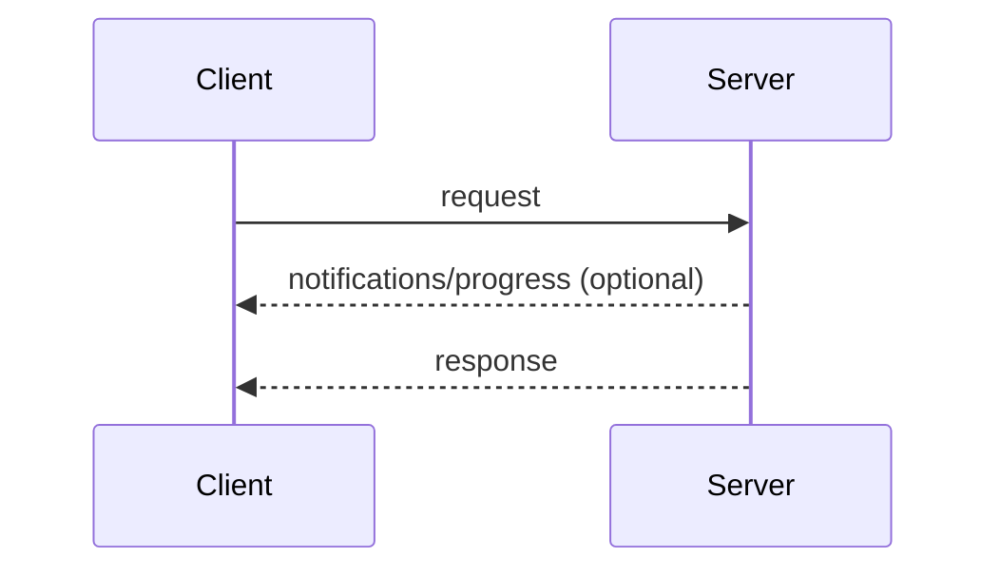
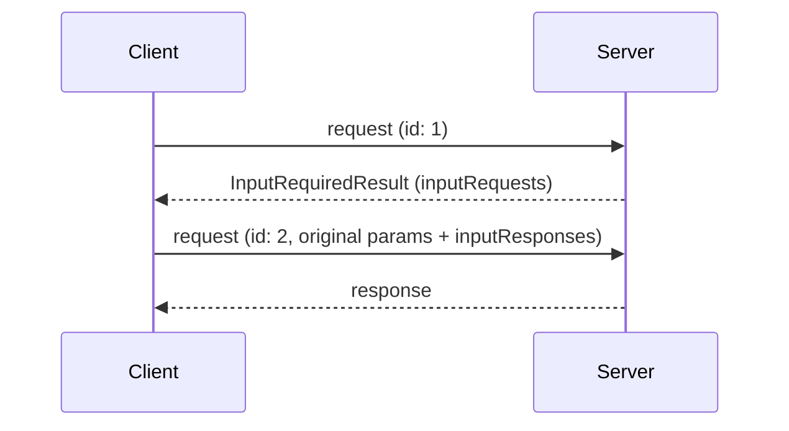
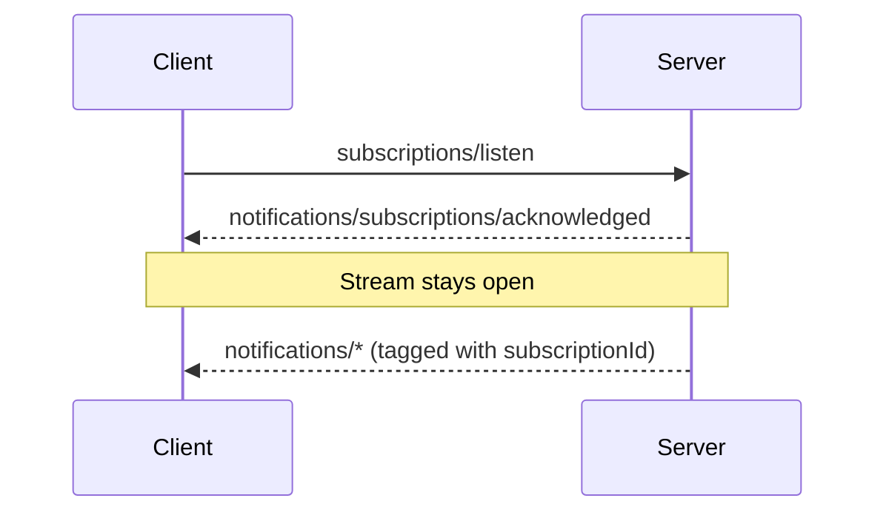

<!--
  Source: https://modelcontextprotocol.io/specification/draft/basic/patterns
  Fetched: 2026-06-13
  Status: DRAFT (2026-07-28-RC)
  WARNING: This is draft content and may change before final release.
-->

# Overview

This page defines the message patterns of the core protocol: the ways a
client and server compose JSON-RPC
requests, responses, and notifications
into interactions. Every
transport carries all of these
patterns; transports differ only in how messages are framed and delivered.

Every interaction begins with the client:

* The **client** sends JSON-RPC *requests* and *notifications*.
* The **server** answers each request with a JSON-RPC *response* (a result
  or error), optionally preceded by *notifications* scoped to that request.

Servers **MUST NOT** initiate JSON-RPC requests, and clients do not send
JSON-RPC responses.

## Request and Response

The client sends a request; the server answers it with a result or an error.
While the request is in flight, the server **MAY** send notifications scoped
to it, such as
`notifications/progress`
and `notifications/message`.

## Multi Round-Trip Requests

When a server needs client input (sampling, elicitation, or roots) to
complete a request, it answers with an
`InputRequiredResult`
and the client retries the request with the matching `inputResponses`. See
[Multi Round-Trip Requests](basic-patterns-mrtr.md).

## Subscribe and Notify

To receive change notifications (list changes, resource updates), the client
sends a
`subscriptions/listen`
request; the reply is a long-lived stream of the requested notification
types. Stream state is scoped to the request: if the underlying channel is
lost, the client re-issues the request.

## Adding Patterns

All core protocol features are built from these patterns. A protocol
revision that adds a pattern defines it on this page. Transports carry new
patterns without changes, because patterns are expressed entirely in terms
of requests, responses, and notifications.
