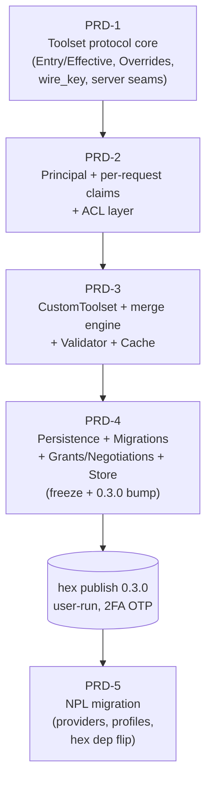

# noizu_mcp 0.3.0 Toolset Architecture — PRD Series Index

**Series**: PRD-1 … PRD-5 for the `noizu_mcp` (elixir-mcp) library upgrade
**Lib repo**: `Portfolio/Libs/ai/elixir-mcp` (version `0.2.0` today, `mix.exs:4`; single `0.3.0` release at series end)
**Host repo**: `Portfolio/Apps/AI/NoizuPromptLingo` (backend/) — PRD-5 only
**Date authored**: 2026-09-02 · **Author**: npl-prd-editor (Loom weave)
**Architecture source**: approved ADR (toolset protocol, weighted merge, ACL-as-layer, persistence+Store); this series implements it faithfully — deviations are called out inline (e.g. PRD-1 §4.1 `coerce/1` protocol-function note)

---

## 1. Overview table

| PRD | File | Title | Repo | One-line scope | Status |
|-----|------|-------|------|----------------|--------|
| 1 | [PRD-1-toolset-core.md](./PRD-1-toolset-core.md) | Toolset Protocol Core | lib | `Toolset` protocol + Behaviour duality, Entry/Effective, closed override vocabulary + applier, `wire_key` cast, server seams (`run_spec` relocation, generated defaults → `protocol_list/protocol_call`), Catalog protocol mode | Draft |
| 2 | [PRD-2-principal-acl.md](./PRD-2-principal-acl.md) | Principal, Per-Request Claims & ACL Layer | lib | `%Auth.Principal{}`, `Session.deliver/3` claims transport, `Ctx.auth`, `Error.forbidden/2`, `ACL` protocol + `Provider` behaviour + `acl:` opt with compile-time checks, enforcement inside behaviour defaults | Draft |
| 3 | [PRD-3-custom-toolset.md](./PRD-3-custom-toolset.md) | CustomToolset, Weighted Merge Engine, Validator & Cache | lib | `%Toolset.Custom{}`, three-pass composition (static → context → materialize), weighted per-op merge with `inherit?`, `Validator.compile/3`, opt-in ETS `Cache`, `toolset:` per-request selection, Catalog default flip, NPL matrix port | Draft |
| 4 | [PRD-4-persistence-store.md](./PRD-4-persistence-store.md) | Persistence, Migrations, Grant/Negotiation Records & Store | lib | `Persistence` behaviour + Memory/Disabled/Ecto providers, selection/precedence (call-time app env), `Migrations` + `Runner` + `V1Toolsets` DDL, `%Permission.Grant/Negotiation`, `Store` write→version-bump→invalidate→`notify_changed(:tools)`, **0.3.0 version bump + interface freeze** | Draft |
| 5 | [PRD-5-npl-migration.md](./PRD-5-npl-migration.md) | NoizuPromptLingua Migration | NPL | `ToolsetProvider` (over NPL's own tables — permanent), `AclProvider` (always-answers), 5 immutable capability profiles, base macro stops emitting `handle_*`, legacy jsonb translated at resolution time (no data migration), conformance-suite port, hex dep flip | Draft |

Every PRD carries: numbered FR/AC, full public surface (module paths, callback signatures, struct field lists), internal seams with verified `file:line` anchors, a test plan including the named anti-pattern regression tests (AP-1 … AP-14), compat/rollback, and open questions for the team lead.

---

## 2. Dependency graph

Strictly sequential by design: each lib PR builds on the previous behaviour defaults (ACL re-homes into the merge engine in PRD-3; persisted layers fill the PRD-3 context seam in PRD-4; PRD-5 consumes only frozen interfaces). Each PRD is independently green on the CUMULATIVE suite at its merge point; PRD-1..4 are additive — NPL and any consumer on hex `0.1.5`/`0.2.0` is unaffected until the flip in PRD-5.

---

## 3. Decision log (user-locked — reflected in every PRD's §2)

1. **Single hex publish.** PRD-1..4 are merged PRs on the lib's `main`; `@version` stays `0.2.0` until all merge; then ONE release bumped to **0.3.0** + hex publish (2FA OTP, **user-run** — agents never publish, never touch keys). NPL develops against the lib via RELATIVE PATH dep (`path:`) during the whole effort, flipping to hex `~> 0.3.0` only in PRD-5.
2. **NPL data disposition PERMANENT.** NPL's persistence provider reads/writes NPL's OWN tables (`mcp_custom_scopes`, `oauth_clients`/`mcp_api_keys` `toolset_config`, future `mcp_tool_sets` + grants). Lib-owned tables serve only lib-default/non-NPL consumers. PRD-5's provider is the END STATE, not a transitional shim (guarded by PRD-5 §7.7 zero-writes test).
3. **Design rules D1–D5** govern every PRD:
   - **D1 one resolver** — listing/dispatch/manifest/Catalog all consume the Toolset protocol.
   - **D2 effective materialization** — materialize before validation/wire-render; `invoke` sees only `%Effective{}`.
   - **D3 runtime-only resolution** — no compile-time env capture; app env read at call time.
   - **D4 explicit participation** — no semantic Any impls, no `function_exported?` probing; `%Ref{}` coercion; compile-time `use`-time checks where config must not boot.
   - **D5 fail-closed per set, fail-open per server** — invalid config disables the set (reason + telemetry), server healthy; config errors that can be caught at compile/boot time fail loudly there instead.
4. **Anti-patterns** (prior-art analysis) explicitly designed against, with named regression tests: decorative ACL (AP-5/AP-9/AP-14: enforced IN the dispatch path, default-DENY when provider configured), forgeable contexts (AP-3/AP-4/AP-13: typed `%Principal{}`, no system fallback), compile-time macro monoliths (AP-2: runtime resolution), multi-layer persistence combinatorics (AP-8/AP-10/AP-11: ONE default + built-ins, ONE merge engine, grants-never-hide), registry brittleness (AP-1/AP-7: composition per-instance, no runtime module scans).

---

## 4. Publish plan

### 4.1 Lib release (after PRD-4)

1. Cumulative suite green on `main` (PRD-1..4 merged; PRD-4 carries the `@version "0.3.0"` bump + CHANGELOG).
2. **User-run** publish (2FA OTP): `mix hex.publish` from `Portfolio/Libs/ai/elixir-mcp`. Verify hex package/docs/links. Agents do NOT publish and do NOT handle hex keys (no-key-rotation standing rule).
3. Tag `v0.3.0` on the lib repo (publish flow or manual).

### 4.2 NPL development protocol (until flip)

- NPL backend `mix.exs` pins `{:noizu_mcp, path: "../../../Libs/ai/elixir-mcp"}` (adjust to the actual checkout-relative path) for the ENTIRE effort — PRD-1..4 merges are immediately visible to the NPL branch but production NPL stays on hex until the flip.
- NPL's migration branch (PRD-5) may merge to NPL `main` ONLY as part of the flip commit sequence below.

### 4.3 Flip-to-hex checklist (PRD-5 §9, normative)

1. Lib 0.3.0 published and visible on hex.
2. NPL: `path:` → `{:noizu_mcp, "~> 0.3.0"}`; `mix deps.update noizu_mcp`.
3. Full NPL conformance suites (PRD-5 §7) + REST tests green.
4. Delete legacy engine modules + original tests; AP-12/13 guards green.
5. NPL `main` commit+push (standing rules: land once green); monorepo gitlink update.
6. Staging smoke: matrix + client-toolsets conformance against session-domain server and `tobor_custom`.

### 4.4 Release hygiene

- 0.3.0 is immutable post-publish: fixes ship as 0.3.1; never re-publish different content under 0.3.0 (PRD-4 §8).
- Post-freeze interface changes require a lead-approved ADR amendment targeting 0.4.0 (PRD-4 §10).

---

## 5. Cross-PRD traceability notes

| Concern | Introduced | Re-homed / completed | Consumed |
|---|---|---|---|
| `run_spec` execution body | `features/tools.ex:190-212` (today) | relocated to `Toolset.Behaviour.invoke/5` (PRD-1); NPL's private copy deleted (PRD-5 §6.8) | all dispatch |
| ACL enforcement | PRD-2 `filter_entries/4` inside behaviour defaults | weight-300 layer of merge engine (PRD-3 §4.2), behavior-identical (PRD-2 suite = gate) | PRD-5 `AclProvider` |
| Context-pass persisted layers | seam returns `[]` (PRD-3 §4.2) | grant/negotiation layers (PRD-4 §4.5) | PRD-5 `ToolsetProvider` |
| `catalog_version` | static hash (PRD-1 §4.7) | layer fingerprints + store versions (PRD-3 §4.4, PRD-4 §4.5) | Cache keys, `list_changed` rotation |
| Step-up / elevation | NPL `ToolGuard` (`dispatch.ex:40-52`) today | negotiation `metadata.elevation_uri` via lib `forbidden` data (PRD-4 §4.5 as amended; PRD-5 §5) — the ONE deliberate wire delta | NPL clients |

---

## 6. Series open questions rollup (lead review list)

- PRD-1: catalog protocol-mode flip point (answered in PRD-3: flips there) · `permissions/3` reason payload · resolve canonicalization scope.
- PRD-2: provider `check_all` extra-verdict handling · principal-MFA failure fail-open-to-anonymous · `supported_kinds` default breadth · scope glob semantics (trailing-`*` only).
- PRD-3: `immutable` = skip-persisted-ACL-still-applies (security-first reading) · base-name keying for include/exclude/tools · cache TTL default 60s vs NPL policy · equal-value equal-weight conflict = loud.
- PRD-4: grants-never-hide division of labor · negotiation-gated tools stay visible · subject JSON-scalar restriction · `toolsets.base` module-string restore · `running_servers` registry mechanism.
- PRD-5: step-up wire delta acceptance · profile include lists as compile-time literals · `custom_scope_slug` transport via `Principal.metadata` · `Session_Manifest` expiry enrichment path.

All open questions are non-blocking for PRD-1 (its §9 list) and blocking-flagged inline where they gate a later PRD's assumptions.
