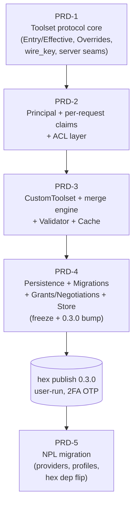
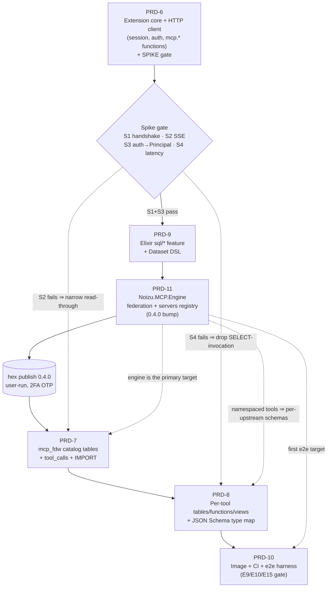

# noizu_mcp 0.3.0 Toolset Architecture — PRD Series Index

**Series**: PRD-1 … PRD-5 for the `noizu_mcp` (elixir-mcp) library upgrade
**Lib repo**: `Portfolio/Libs/ai/elixir-mcp` (version `0.2.0` today, `mix.exs:4`; single `0.3.0` release at series end)
**Host repo**: `Portfolio/Apps/AI/NoizuPromptLingo` (backend/) — PRD-5 only
**Date authored**: 2026-09-02 · **Author**: npl-prd-editor (Loom weave)
**Architecture source**: approved ADR (toolset protocol, weighted merge, ACL-as-layer, persistence+Store); this series implements it faithfully — deviations are called out inline (e.g. PRD-1 §4.1 `coerce/1` protocol-function note)

---

## 1. Overview table

| PRD | File | Title | Repo | One-line scope | Status |
|-----|------|-------|------|----------------|--------|
| 1 | [PRD-1-toolset-core.md](./PRD-1-toolset-core.md) | Toolset Protocol Core | lib | `Toolset` protocol + Behaviour duality, Entry/Effective, closed override vocabulary + applier, `wire_key` cast, server seams (`run_spec` relocation, generated defaults → `protocol_list/protocol_call`), Catalog protocol mode | Draft |
| 2 | [PRD-2-principal-acl.md](./PRD-2-principal-acl.md) | Principal, Per-Request Claims & ACL Layer | lib | `%Auth.Principal{}`, `Session.deliver/3` claims transport, `Ctx.auth`, `Error.forbidden/2`, `ACL` protocol + `Provider` behaviour + `acl:` opt with compile-time checks, enforcement inside behaviour defaults | Draft |
| 3 | [PRD-3-custom-toolset.md](./PRD-3-custom-toolset.md) | CustomToolset, Weighted Merge Engine, Validator & Cache | lib | `%Toolset.Custom{}`, three-pass composition (static → context → materialize), weighted per-op merge with `inherit?`, `Validator.compile/3`, opt-in ETS `Cache`, `toolset:` per-request selection, Catalog default flip, NPL matrix port | Draft |
| 4 | [PRD-4-persistence-store.md](./PRD-4-persistence-store.md) | Persistence, Migrations, Grant/Negotiation Records & Store | lib | `Persistence` behaviour + Memory/Disabled/Ecto providers, selection/precedence (call-time app env), `Migrations` + `Runner` + `V1Toolsets` DDL, `%Permission.Grant/Negotiation`, `Store` write→version-bump→invalidate→`notify_changed(:tools)`, **0.3.0 version bump + interface freeze** | Draft |
| 5 | [PRD-5-npl-migration.md](./PRD-5-npl-migration.md) | NoizuPromptLingua Migration | NPL | `ToolsetProvider` (over NPL's own tables — permanent), `AclProvider` (always-answers), 5 immutable capability profiles, base macro stops emitting `handle_*`, legacy jsonb translated at resolution time (no data migration), conformance-suite port, hex dep flip | Draft |

Every PRD carries: numbered FR/AC, full public surface (module paths, callback signatures, struct field lists), internal seams with verified `file:line` anchors, a test plan including the named anti-pattern regression tests (AP-1 … AP-14), compat/rollback, and open questions for the team lead.

---

## 2. Dependency graph

Strictly sequential by design: each lib PR builds on the previous behaviour defaults (ACL re-homes into the merge engine in PRD-3; persisted layers fill the PRD-3 context seam in PRD-4; PRD-5 consumes only frozen interfaces). Each PRD is independently green on the CUMULATIVE suite at its merge point; PRD-1..4 are additive — NPL and any consumer on hex `0.1.5`/`0.2.0` is unaffected until the flip in PRD-5.

---

## 3. Decision log (user-locked — reflected in every PRD's §2)

1. **Single hex publish.** PRD-1..4 are merged PRs on the lib's `main`; `@version` stays `0.2.0` until all merge; then ONE release bumped to **0.3.0** + hex publish (2FA OTP, **user-run** — agents never publish, never touch keys). NPL develops against the lib via RELATIVE PATH dep (`path:`) during the whole effort, flipping to hex `~> 0.3.0` only in PRD-5.
2. **NPL data disposition PERMANENT.** NPL's persistence provider reads/writes NPL's OWN tables (`mcp_custom_scopes`, `oauth_clients`/`mcp_api_keys` `toolset_config`, future `mcp_tool_sets` + grants). Lib-owned tables serve only lib-default/non-NPL consumers. PRD-5's provider is the END STATE, not a transitional shim (guarded by PRD-5 §7.7 zero-writes test).
3. **Design rules D1–D5** govern every PRD:
   - **D1 one resolver** — listing/dispatch/manifest/Catalog all consume the Toolset protocol.
   - **D2 effective materialization** — materialize before validation/wire-render; `invoke` sees only `%Effective{}`.
   - **D3 runtime-only resolution** — no compile-time env capture; app env read at call time.
   - **D4 explicit participation** — no semantic Any impls, no `function_exported?` probing; `%Ref{}` coercion; compile-time `use`-time checks where config must not boot.
   - **D5 fail-closed per set, fail-open per server** — invalid config disables the set (reason + telemetry), server healthy; config errors that can be caught at compile/boot time fail loudly there instead.
4. **Anti-patterns** (prior-art analysis) explicitly designed against, with named regression tests: decorative ACL (AP-5/AP-9/AP-14: enforced IN the dispatch path, default-DENY when provider configured), forgeable contexts (AP-3/AP-4/AP-13: typed `%Principal{}`, no system fallback), compile-time macro monoliths (AP-2: runtime resolution), multi-layer persistence combinatorics (AP-8/AP-10/AP-11: ONE default + built-ins, ONE merge engine, grants-never-hide), registry brittleness (AP-1/AP-7: composition per-instance, no runtime module scans).

---

## 4. Publish plan

### 4.1 Lib release (after PRD-4)

1. Cumulative suite green on `main` (PRD-1..4 merged; PRD-4 carries the `@version "0.3.0"` bump + CHANGELOG).
2. **User-run** publish (2FA OTP): `mix hex.publish` from `Portfolio/Libs/ai/elixir-mcp`. Verify hex package/docs/links. Agents do NOT publish and do NOT handle hex keys (no-key-rotation standing rule).
3. Tag `v0.3.0` on the lib repo (publish flow or manual).

### 4.2 NPL development protocol (until flip)

- NPL backend `mix.exs` pins `{:noizu_mcp, path: "../../../Libs/ai/elixir-mcp"}` (adjust to the actual checkout-relative path) for the ENTIRE effort — PRD-1..4 merges are immediately visible to the NPL branch but production NPL stays on hex until the flip.
- NPL's migration branch (PRD-5) may merge to NPL `main` ONLY as part of the flip commit sequence below.

### 4.3 Flip-to-hex checklist (PRD-5 §9, normative)

1. Lib 0.3.0 published and visible on hex.
2. NPL: `path:` → `{:noizu_mcp, "~> 0.3.0"}`; `mix deps.update noizu_mcp`.
3. Full NPL conformance suites (PRD-5 §7) + REST tests green.
4. Delete legacy engine modules + original tests; AP-12/13 guards green.
5. NPL `main` commit+push (standing rules: land once green); monorepo gitlink update.
6. Staging smoke: matrix + client-toolsets conformance against session-domain server and `tobor_custom`.

### 4.4 Release hygiene

- 0.3.0 is immutable post-publish: fixes ship as 0.3.1; never re-publish different content under 0.3.0 (PRD-4 §8).
- Post-freeze interface changes require a lead-approved ADR amendment targeting 0.4.0 (PRD-4 §10).

---

## 5. Cross-PRD traceability notes

| Concern | Introduced | Re-homed / completed | Consumed |
|---|---|---|---|
| `run_spec` execution body | `features/tools.ex:190-212` (today) | relocated to `Toolset.Behaviour.invoke/5` (PRD-1); NPL's private copy deleted (PRD-5 §6.8) | all dispatch |
| ACL enforcement | PRD-2 `filter_entries/4` inside behaviour defaults | weight-300 layer of merge engine (PRD-3 §4.2), behavior-identical (PRD-2 suite = gate) | PRD-5 `AclProvider` |
| Context-pass persisted layers | seam returns `[]` (PRD-3 §4.2) | grant/negotiation layers (PRD-4 §4.5) | PRD-5 `ToolsetProvider` |
| `catalog_version` | static hash (PRD-1 §4.7) | layer fingerprints + store versions (PRD-3 §4.4, PRD-4 §4.5) | Cache keys, `list_changed` rotation |
| Step-up / elevation | NPL `ToolGuard` (`dispatch.ex:40-52`) today | negotiation `metadata.elevation_uri` via lib `forbidden` data (PRD-4 §4.5 as amended; PRD-5 §5) — the ONE deliberate wire delta | NPL clients |

---

## 6. Series open questions rollup (lead review list)

- PRD-1: catalog protocol-mode flip point (answered in PRD-3: flips there) · `permissions/3` reason payload · resolve canonicalization scope.
- PRD-2: provider `check_all` extra-verdict handling · principal-MFA failure fail-open-to-anonymous · `supported_kinds` default breadth · scope glob semantics (trailing-`*` only).
- PRD-3: `immutable` = skip-persisted-ACL-still-applies (security-first reading) · base-name keying for include/exclude/tools · cache TTL default 60s vs NPL policy · equal-value equal-weight conflict = loud.
- PRD-4: grants-never-hide division of labor · negotiation-gated tools stay visible · subject JSON-scalar restriction · `toolsets.base` module-string restore · `running_servers` registry mechanism.
- PRD-5: step-up wire delta acceptance · profile include lists as compile-time literals · `custom_scope_slug` transport via `Principal.metadata` · `Session_Manifest` expiry enrichment path.

All open questions are non-blocking for PRD-1 (its §9 list) and blocking-flagged inline where they gate a later PRD's assumptions.

---
---

# Series 2 — pg_mcp: MCP servers as Postgres structures (0.4.0)

**Series**: PRD-6 … PRD-11 (six PRDs)
**Lib repo**: `Portfolio/Libs/ai/elixir-mcp` (version `0.3.0` today, `mix.exs:4`; single `0.4.0` release in PRD-11)
**New library component**: `Noizu.MCP.Engine` (`lib/noizu/mcp/engine/`) — the primary counterpart of the extension
**New subproject**: `pg/pg_mcp/` — a Rust/pgrx PostgreSQL extension living beside the existing `daemon/mcp_mount/` escript
**Date authored**: 2026-09-05 · **Author**: npl-prd-editor (Loom weave)
**Architecture source**: ADR-001 … ADR-007 in `docs/adrs/`. Each PRD's §2 maps the ADRs onto its own scope; deviations are called out inline.

**The shape of the thing.** An operator installs the extension once and registers **one** foreign server, pointing at the engine. Every MCP server after that is a row: `INSERT INTO engine.servers (name, transport, command, auth_ref, enabled) VALUES (…)`. The engine holds the upstream connections, so stdio servers, private-network servers and OAuth servers all become reachable from SQL even though Postgres itself can reach none of them.

## 7. Overview table

| PRD | File | Title | Repo | One-line scope | Status |
|-----|------|-------|------|----------------|--------|
| 6 | [PRD-6-pg-mcp-client-core.md](./PRD-6-pg-mcp-client-core.md) | pg_mcp extension core & spike | `pg/pg_mcp` (new) | pgrx skeleton; Streamable HTTP JSON-RPC client, one MCP session per backend with `Mcp-Session-Id` caching and minimal SSE reader; Bearer from `USER MAPPING`; six `mcp.*` SQL functions; option validators; **go/no-go spike gate** | Draft |
| 9 | [PRD-9-sql-extension-and-datasets.md](./PRD-9-sql-extension-and-datasets.md) | elixir-mcp `sql/*` feature & Dataset DSL | lib (Elixir) | `sql/schema`/`sql/scan`/`sql/modify`; `Dataset` behaviour + `dataset/2` macro; `SQL.{Schema,Types,Quals}`; `experimental.sql` capability; FDW `mode 'sql'`/`auto`; docs | Draft |
| 11 | [PRD-11-engine-federation.md](./PRD-11-engine-federation.md) | `Noizu.MCP.Engine` — upstream federation | lib (Elixir) | engine server module; writable `servers` dataset over existing Persistence, credentials by reference; supervised upstream sessions with backoff and status; `<server>.<name>` namespacing as one Toolset layer per upstream at weight 100; ACL per principal; optional token pass-through; `engine.attach/detach/refresh`; `mix mcp.engine`; **single `0.4.0` bump + publish** | Draft |
| 7 | [PRD-7-mcp-fdw-catalog-and-invocation.md](./PRD-7-mcp-fdw-catalog-and-invocation.md) | `mcp_fdw` catalog tables, `tool_calls`, generic import | `pg/pg_mcp` | nine foreign tables (catalog + read-through); `tool_calls` INSERT-invokes / SELECT-logs; qual pushdown rules; TTL catalog cache; full MCP-error → SQLSTATE map; `IMPORT FOREIGN SCHEMA mcp` with `all_upstreams` for engine targets | Draft |
| 8 | [PRD-8-per-tool-codegen.md](./PRD-8-per-tool-codegen.md) | Per-tool tables, functions, views & type mapping | `pg/pg_mcp` | JSON Schema → PG type map; `tool_<name>` foreign tables; `readOnlyHint` gates SELECT-invocation; typed function per tool; `v_tool_<name>`; identifier rules; per-upstream schemas against an engine; `mcp.generate_functions` | Draft |
| 10 | [PRD-10-packaging-and-e2e.md](./PRD-10-packaging-and-e2e.md) | Packaging, image, CI & e2e harness | `pg/pg_mcp` + infra | image layering onto the cluster TimescaleDB base; GitHub Actions `cargo pgrx package` pg16–18; `pg_mcp_e2e_test.exs` driving real Postgres against a real **engine** with stdio upstreams; install runbook; Terraform bump note | Draft |

Every PRD carries: numbered FR/AC, full public surface (SQL DDL, function signatures, Elixir callback specs), internal seams with verified `file:line` anchors, a test plan including named anti-pattern regression tests (AP-P1 … AP-P17), compat/rollback, and open questions for the team lead.

## 8. Dependency graph

The order is Elixir-first after the spike. PRD-9 defines the Dataset behaviour, PRD-11's upstream registry **is** a dataset, so the two ship in one release and the library is complete before any Rust work consumes it. PRD-7, 8 and 10 then build against a published `0.4.0` and against an engine that already exists to point at.

One hard gate remains at PRD-6. **S1** (handshake) or **S3** (auth → `%Principal{}`) failing stops the series. **S2** failing narrows PRD-7's read-through tables to JSON-fast-path servers. **S4** (latency) failing removes SELECT-invocation from PRD-8, leaving per-tool tables INSERT-only — and note that S4 must now be measured *through an engine*, since federation adds a second hop.

## 9. Decision log (ADR-backed — reflected in every PRD's §2)

1. **Install once: one extension, one foreign server, MCPs attached as rows (ADR-007).** This is the organizing principle of the series. An operator does `CREATE EXTENSION`, `CREATE SERVER engine`, `CREATE USER MAPPING` — once — and every MCP server thereafter arrives as an `INSERT INTO engine.servers`. Per-server registration in Postgres is retained as generic mode and is the fallback, not the path.
2. **ADR-001 — a real Postgres extension, not a pg-wire emulation.** Emulating Postgres means building a wire codec, a SQL parser, SCRAM, and a fake `pg_catalog` large enough to satisfy psql, JDBC and DBeaver — and it can never join MCP data with application data. Being *inside* Postgres inherits login, roles, TLS, RLS, the planner and joins for free.
3. **ADR-002 — pgrx 0.19 + `supabase-wrappers` as a library.** The crate supplies quals/sorts/limit pushdown, `begin_modify`/`insert`/`update`/`delete`, `import_foreign_schema` and option validation; we read user mappings directly via `pg_sys::GetUserMapping` where its safe API stops. HTTP is a blocking client, no tokio in the backend. Wasm FDW is deferred as a later distribution mode (its guests cannot read user mappings, and no Noizu image ships the `wrappers` extension); Multicorn2 rejected.
4. **ADR-003 — SQL projection model.** Catalog tables mirror MCP list methods; invocation is `INSERT INTO tool_calls`; per-tool tables/functions/views are generated from published schemas. `annotations.readOnlyHint` is the sole gate for SELECT-invocation, because the server is the party that knows. A tool reporting `isError` yields a **row**, never an exception.
5. **ADR-004 — identity.** Postgres roles + `USER MAPPING` token → `Authorization: Bearer` → the elixir-mcp verifier chain (`lib/noizu/mcp/auth/token_verifier.ex`, `chain_verifier.ex`, `jwt_verifier.ex`, `api_key_verifier.ex`) → `%Noizu.MCP.Auth.Principal{}` (`lib/noizu/mcp/auth/principal.ex:24`). A nil principal is anonymous and is **never synthesized** from a rejected token. `auth 'none'` is loopback-only. Caches are keyed by user OID; no row crosses roles. With the engine, the caller's token identifies them *to the engine*, which holds upstream credentials by reference and decides through ACL what each principal sees.
6. **ADR-005 — `sql/*` experimental methods + Dataset DSL.** A server may describe relations it wants projected; FDW `mode` is `auto` (default), `generic` or `sql`. `auto` resolves from the cached `initialize` capabilities with no extra round trip. The Dataset behaviour is what makes the engine's registry expressible, which is why PRD-9 immediately precedes PRD-11.
7. **ADR-006 — placement.** The extension is a subproject at `pg/pg_mcp/`, following the `daemon/mcp_mount/` precedent. The hex package stays pure Elixir (a packaging test fails the build if `pg/` reaches the tarball). Distribution is image layering, not hex, not PGXN. The engine, by contrast, ships **in** the hex package.
8. **ADR-007 — engine federation.** `Noizu.MCP.Engine` is a `use Noizu.MCP.Server` server whose content is other MCP servers. Upstreams are rows in a writable `servers` dataset persisted through the existing providers, with credentials held **by reference only** — an `auth_ref` that looks like a raw token is rejected at insert. Each ready upstream contributes one `%Context.Layer{}` at **weight 100**, below persisted (200) and ACL (300), so operator overrides win and ACL filters federated tools with no federation-specific precedence code. A down upstream contributes an empty layer and never fails `tools/list`.
9. **Design rules D1–D5 carry over from series 1**, read for this domain:
   - **D1 one resolver** — the SQL schema derives from the Toolset protocol (`lib/noizu/mcp/toolset.ex:41`), `Features.Prompts` and `Features.Resources`; federated tools enter as Toolset layers, never a parallel registry. Regeneration re-reads; it never patches.
   - **D2 effective materialization** — generated objects, `sql/schema` and federated entries all describe the *effective* surface for the requesting principal.
   - **D3 runtime-only resolution** — no URL, token, timeout or upstream captured at build time; every value read at call time.
   - **D4 explicit participation** — datasets participate by registration; upstreams federate because a row says so. No discovery, no probing.
   - **D5 fail-closed per table, fail-open per server** — a `-32601` on a list method makes that table empty, not the server broken; a raising dataset fails one relation; a down upstream fails none.
10. **Anti-patterns designed against, with named regression tests** (AP-P1 … AP-P17): a parallel registry of tools held in Postgres or in the engine (AP-P1/P7/P9/P14), `SELECT` with hidden side effects (AP-P2/P5), cross-role cache bleed (AP-P3), a permission-error discovery oracle (AP-P4), remote-triggered DDL (AP-P6), privilege escalation by generation (AP-P8), a trusted-context auth bypass (AP-P10), silent opt-in to `sql/*` (AP-P11), trusting a dataset's qual filtering (AP-P12), a credential landing in a registry row or log (AP-P13), one failing upstream taking down the rest (AP-P15), federation bypassing ACL (AP-P16), and the registry leaking the existence of upstreams a principal may not use (AP-P17).

## 10. Publish plan (0.4.0)

### 10.1 Lib release (in PRD-11)

1. PRD-6 merges first and touches no library code — `mix.exs` stays `0.3.0`.
2. PRD-9 merges next, also without a bump, so the Dataset behaviour never ships a release ahead of its first consumer.
3. PRD-11 carries the `@version "0.4.0"` bump (`mix.exs:4`) plus the CHANGELOG section covering PRD-6, 9 and 11.
4. Cumulative suite green: `mix test`, `mix format --check-formatted`, `mix credo`, `mix dialyzer`, and `cargo pgrx test` on pg16/17/18.
5. **User-run** publish (2FA OTP): `mix hex.publish`. Agents do not publish and do not handle hex keys — the standing rule from series 1 is unchanged.
6. Tag `v0.4.0`. PRD-7, 8 and 10 then merge against a published version.

**Why the bump sits in PRD-11, not PRD-9 or at series end.** PRD-11 is the last PR touching library code; PRD-7, 8 and 10 are Rust and CI. Bumping in PRD-9 would publish a Dataset behaviour with no consumer in the same release. Bumping at series end would leave the Rust work building against an unpublished library for three PRs. PRD-11 is the point where the Elixir side is complete and the Rust side has something stable to build on.

### 10.2 Extension release (in PRD-10)

1. Build the layered image; the tag is the base tag plus `-mcp<version>-r<revision>`.
2. Image smoke test must pass: `CREATE EXTENSION pg_mcp` succeeds and every pre-existing extension on the base still creates.
3. Push on tag only; PR builds are discarded.
4. Terraform image bump (`terraform/kubernetes/modules/timescaledb/variables.tf:22-26`) is a **separate, operator-applied monorepo change**. PRD-10 supplies the diff; it does not apply it. An HA image roll means a failover — schedule it.
5. The engine needs a deployment target of its own, which ADR-007 defers outside this repo. That gap is open question 2 below and blocks a production rollout, not the series.

### 10.3 Release hygiene

- `0.4.0` is immutable post-publish; fixes ship as `0.4.1`.
- `0.4.0` is a minor bump. Consumers pinning `~> 0.3` do not pick it up; the CHANGELOG recommends `~> 0.4`.
- `experimental.sql` is version-tagged `1`. If MCP standardizes a comparable family, that integer is the migration lever.
- Post-series interface changes to `sql/*` or the Engine's dataset shape require a lead-approved ADR amendment.

## 11. Cross-PRD traceability notes

| Concern | Introduced | Extended / completed | Consumed |
|---|---|---|---|
| MCP session + `Mcp-Session-Id` | PRD-6 §4.4 | catalog cache keyed alongside it (PRD-7 §4.10) | every table scan and insert |
| `errors.rs` SQLSTATE map | PRD-6 §4.7 (subset) | full table (PRD-7 §4.9) | PRD-8 per-tool errors, PRD-10 e2e |
| `mcp.refresh/1` | PRD-6 §4.6 (session only) | + catalog drop (PRD-7 §4.10); + staleness NOTICE naming the changed upstream (PRD-8 §4.6) | operator runbook (PRD-10 §4.5) |
| Dataset behaviour | PRD-9 §4.1 | the `servers` registry is its first real implementation (PRD-11 §4.2) | `INSERT INTO engine.servers` |
| Toolset layer weights | series-1 PRD-3 (persisted 200, ACL 300) | federation at weight 100 (PRD-11 §4.4) | operator overrides win, ACL filters, with no new precedence code |
| `<server>.<name>` namespacing | PRD-11 §4.4 | per-upstream schemas on import (PRD-7 §4.11) and on generation (PRD-8 §4.6) | `github.create_issue(…)` in SQL |
| `IMPORT FOREIGN SCHEMA` | PRD-7 §4.11 (generic, `all_upstreams`) | + `per_tool`/`invoke_on_select`/`prefix`/`per_upstream_schema` (PRD-8 §4.6) | install runbook |
| JSON Schema → PG type map | PRD-8 §4.1 (Rust) | mirrored by `SQL.Types` (PRD-9 §4.3); equality asserted by a shared fixture | generated columns, dataset columns |
| FDW `mode` option | PRD-6 §4.2 (validated, `auto`→`generic`) | `auto` probing + `sql` semantics (PRD-9 §4.6) | `mcp.server.mode` column |
| Identity chain (`USER MAPPING` → Principal) | PRD-6 §4.3 + spike S3 | per-user cache keying (PRD-7), per-role generation (PRD-8), engine-side ACL over upstreams (PRD-11 §4.5) | **PRD-10 E9/E10 — half the series' merge gate** |
| ACL subject for SQL reads | ADR-005 | tool-derived relations borrow the tool's verdict; datasets take `{:dataset, name}` (PRD-9 §4.4) | PRD-11 §4.5 filters upstreams and the `servers` registry alike |
| `isError` disposition | ADR-003 | functions raise by default with `on_error => 'return'` (PRD-6 §4.6); tables always return a row (PRD-7 §4.7) | PRD-10 E4 asserts the table half, AC-6.3 the function half |
| `mcp.import/3` | declared PRD-6 §4.6 | implemented with `IMPORT FOREIGN SCHEMA` as one path (PRD-7 §4.11) | Liquibase changelogs, which cannot parameterize the DDL form (PRD-10 §4.5 step 9) |
| Install-once claim (ADR-007) | PRD-11 §4.10 | runbook (PRD-10 §4.5) | **PRD-10 E15 — the other half of the merge gate** |

## 12. Open questions for the user (lead review list)

**Blocking**

1. **Spike target and the second hop (PRD-6 Q1).** Federation makes every `tools/call` two hops, so S4's latency bar must be measured through an engine with an upstream attached, not against a bare fixture server. Which deployment is the target — local, staging, or NPL production? S4's outcome decides whether SELECT-invocation exists at all.
2. **Where does the engine run (PRD-11 Q2)?** ADR-007 defers "a dedicated deployable app" to a follow-up outside this repo, which leaves the series' primary path with no deployment target. Embedded in an existing host app, or standalone via `mix mcp.engine` in a container someone must build? This blocks a production rollout, not the PRDs.
3. **Per-upstream schemas, and whether import is automatic (PRD-7 Q6a, PRD-8 Q6, PRD-11 Q1 — one decision).** Current spec: `all_upstreams` defaults to **false**, and generation splits by upstream into one schema each. Automatic creation is the more seductive reading of "install once", but it means a later `INSERT INTO engine.servers` silently changes what a re-import produces. Explicit opt-in is the recommendation.
4. **Base image ownership (PRD-10 Q1).** `docker.io/noizu/timescaledb-ha-with-age` is not built anywhere in this workspace. Layering works without the source; a CVE patch or a Postgres minor bump does not.
5. **Arrays: `jsonb` or `text[]` (PRD-8 Q2, PRD-9 Q5).** One decision spanning two PRDs, and breaking to change after 0.4.0. Current spec is `jsonb` everywhere, for null-distinguishability.
6. **`mode 'sql'` scope (PRD-9 Q1).** Does a server in `sql` mode still get `tool_calls` and per-tool objects? Spec says yes — `sql/*` projects relations, not invocation.

**Non-blocking, wanted before implementation**

7. **Pass-through for stdio upstreams (PRD-11 Q4)** — a per-principal session against a stdio upstream means one spawned OS process per caller. Recommend refusing pass-through for stdio entirely.
8. **Namespace separator (PRD-11 Q6)** — `.` in `github.create_issue`. Series 1 left dotted-name canonicalization host-side. Confirm no collision with a host's existing convention, and that question 3 settles what the SQL shape becomes.
9. **`secret:` resolver scope (PRD-11 Q3)** — does the library ship an Infisical resolver, or is `infisical:` merely a naming convention the host's resolver interprets? Recommend the latter.
10. **Derived `servers.status` (PRD-11 Q5)** — a restarted engine reports `disconnected` until sessions establish. Confirm that over persisting a last-known status, which would be stale.
11. **`tool_calls.id` provenance (PRD-7 Q1)** — extension-generated UUID, or a server-supplied correlation id that would make the audit table joinable to server telemetry?
12. **`SELECT` on `tool_calls` (PRD-7 Q2)** — backend-local log as specified, or transparently union the configured `audit_table`?
13. **Default function prefix (PRD-8 Q5)** — empty (ergonomic) or `mcp_` (collision-safe) for generated functions in a shared schema?
14. **Enums as `text` + comment (PRD-8 Q3)** — confirm, rather than a PG enum type per tool that regeneration cannot shrink.
15. **`token_secret` shape (PRD-6 Q2)** — a plain `(role, token)` table, or something Infisical-backed?
16. **SSE resume (PRD-6 Q3)** — is `08006` on a dropped mid-call stream acceptable for 0.4.0, with no `Last-Event-ID` replay?
17. **Positional vs object rows in `sql/scan` (PRD-9 Q2)** — positional is the hot path; does the `"format":"objects"` debug escape hatch ship in 0.4.0?
18. **`generate_functions` privilege (PRD-8 Q4)** — is `CREATE` on the target schema enough, or does a `pg_mcp_generator` role separate "can query MCP" from "can create objects"?
19. **CI stdio fixtures (PRD-10 Q4a)** — the e2e engine spawns stdio upstreams inside CI, so the fixtures must run with no network fetch (an escript or `elixir -e`, not `npx -y`). Confirm before the fixture is written.
20. **e2e CI cadence (PRD-10 Q3)** — every `pg/**` PR, or tags plus nightly?
21. **Liquibase ownership of generated DDL (PRD-10 Q6)** — per-application changelog, or a new shared target in `.infra-config.yaml`?
22. **Layered image name and registry (PRD-10 Q2)** — reuse the base lineage with an `-mcp` suffix, or a separate name?

**Anchor notes.** Every `file:line` in series 2 was verified against this worktree on 2026-09-05. `Noizu.MCP.Toolset.catalog/3` is at `lib/noizu/mcp/toolset.ex:41` — a brief circulated `:42`, and no PRD carries that. The stdio client naming flagged earlier has since been corrected in ADR-007 itself, which now reads `Noizu.MCP.Transport.Stdio.Client`; PRD-11 §9 Q7 is marked resolved rather than deleted, so the trail stays legible.

**ADR conformance pass (2026-09-05).** All seven ADRs were re-read against the finished PRDs. Five gaps were closed rather than left as deviations: `mcp.import/3` was missing from the function surface (ADR-003) and is now declared in PRD-6 §4.6 and implemented in PRD-7 §4.11; function-level `isError` handling now defaults to raising with an `on_error => 'return'` opt-out (ADR-003) while tables still always return a row, and PRD-6 §4.6 states why the two differ; `idx` replaces `position` as the ordinal column name (ADR-003); `sql/schema` now declares invoke kind, `qual_columns`, `required_quals`, `sort` and `limit` per relation (ADR-005), which is what lets `mode 'sql'` build tables without inferring anything; and datasets take an ACL subject of their own while tool-derived relations borrow the tool's verdict (ADR-005). ADR-006's stock `postgres:17` local-development base is now a `BASE_IMAGE` build arg in PRD-10 §4.1.
